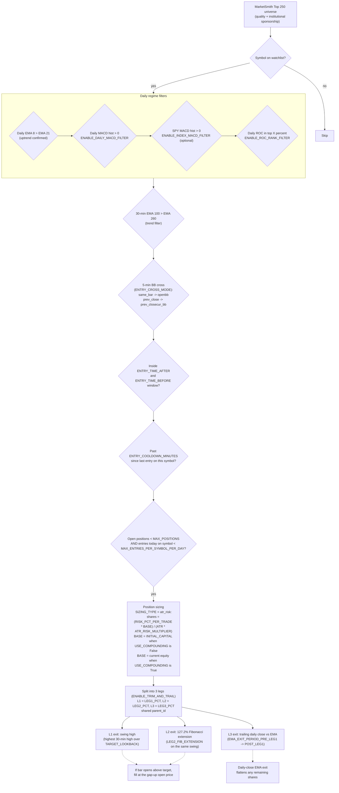

# BB 5-Min Cross – IB Trading Bot Architecture

This repository contains **two related but not identical** implementations of the same strategy idea:

- **Live IB bot** (repo root: `main.py`, `config.py`, `order_engine.py`, ...) — the production-simple version that talks to Interactive Brokers in real time.
- **Backtest engine** (`backtest/bt_*.py`) — the experimentation lab where new ideas are added first. See [`backtest/README.md`](backtest/README.md) for its dedicated documentation.

This file documents the **live IB bot**. The strategy premise, the decision-engine diagram, and the live-vs-backtest feature parity matrix below apply to both.

---

## AI Agent Quick Start

Read this 30-line block first; deep-dive only when needed.

**Mental model.** `main.py` is an event loop driven by `ib.waitOnUpdate()`. Each loop iteration: drain new completed bars from `C.new_completed_bars`, on every closed 5-min bar run `entry_filters.evaluate_entry_filters(...)`, on a pass run `order_engine.place_entry_order(...)`, then `track_fills(...)` to manage live brackets. Per-symbol state lives in `context.Context` (`C`). Every tuneable value lives in `config.py` (which constructs an `ACTIVE_STRATEGY = StrategyConfig(...)` from `strategy_config.py`).

**File you'll touch most often -> what's in it:**

| Want to ... | File | Function / field |
|---|---|---|
| Change any strategy knob | `config.py` | `ACTIVE_STRATEGY = StrategyConfig(...)` |
| Change the entry-trigger rule | `strategy_config.py` | `check_entry_conditions(mode, bar_open, bar_close, lower_bb, prev_close, prev_lower_bb)` |
| Add a pre-entry filter | `entry_filters.py` | `evaluate_entry_filters(...)` |
| Cross-symbol daily snapshot (ROC, index MACD) | `daily_filters.py` | `refresh_daily_snapshot(...)` |
| Position sizing | `order_engine.py` | `calculate_position_size(...)` |
| Multi-leg entry/exit placement | `order_engine.py` | `_split_into_legs_and_place_brackets(...)`, `_track_leg_fills(...)` |
| Daily-close EMA exit (after market close) | `eod_hook.py` | `run_daily_ema_exit(...)` |
| Overnight position recovery | `state_io.py` | `reconcile_with_ib(...)` |
| Bar download / indicators / tz normalisation | `data_manager.py` | `download_all_timeframes(...)`, `calculate_indicators(...)` |
| Add a new field to per-symbol state | `context.py` | `Context.__init__` |
| Main loop / hot-reload / PRE-SIGNAL log | `main.py` | `main()`, `_check_watchlist_changes(...)`, `_5MIN_DIAG` block |
| Edit watchlist (no restart needed) | `watchlist.csv` | -- (hot-reloaded by `_check_watchlist_changes`) |

**Cross-bot parity.** Anything you can configure in `backtest/bt_config.py` you can configure here in `strategy_config.py`. The two engines share the same decision ladder; the parity matrix in §3 lists everything that's identical (and the few items that are inherently one-sided).

**For backtesting / parameter research:** see [`backtest/README.md`](backtest/README.md). Keep new ideas there first, then promote.

---

## 1. Strategy Premise

We invest only in the **highest-quality stocks** that institutional money — funds, hedge funds, mutual funds — is accumulating. The universe is sourced from the **MarketSmith Top 250** list (best earnings growth, best institutional sponsorship, best technical and fundamental ratios), refreshed dynamically.

What we trade is the empirical edge that **trends continue longer than humans expect**. Up-trending stocks tend to keep up-trending. We buy **short-term dips inside longer-term up-trends** in those highest-quality names, and we use moving averages to **give the stock room to breathe** instead of stopping ourselves out of normal noise.

As the move develops we **trim and trail**: take partial profits at fixed levels, then ride the remainder on a moving-average trail so positive outlier moves can drive the asymmetric P&L that pays for the losers. As of the parity rewrite, **trim-and-trail is implemented in both the live bot and the backtest** — see §3.

---

## 2. Decision Engine

### 2.1 Decision flow



### 2.2 Why this approach (advantages)

- **Quality universe lowers blow-up risk.** We never have to pick "what to buy" — the MarketSmith Top 250 has already done the institutional vetting. The strategy only picks **when** to buy.
- **Trend-following inside a quality filter has a long-run positive expectancy.** Trends really do over-extend, especially in stocks that everyone wants to own.
- **Buying dips, not breakouts.** Lower entry price means better risk:reward, less slippage, less giving back on the first pullback.
- **Moving averages give the stock room to breathe.** A daily-close-vs-EMA stop ignores intraday noise and only reacts when the trend itself changes character — fewer death-by-1000-cuts stops.
- **Trim-and-trail produces asymmetric payoffs.** Locking in L1 + L2 turns a high win-rate into a positive expectancy even before L3 hits. L3 alone produces the fat-tailed winners that make the curve steep.
- **Stack of independent filters keeps us out of bad regimes.** Daily uptrend + 30-min trend + MACD + (optional) index MACD + ROC rank means the bot only fires when **everything** is supportive, not when one indicator is loud.
- **Non-compounding default makes results comparable across years.** A bad year is not punished by a small base; a good year is not flattered by a large one. Compounding is opt-in (`USE_COMPOUNDING = True`).
- **Multi-leg + `parent_id` makes attribution honest.** Per-leg P&L tells you which exit is paying; parent-level analysis tells you which setups work.

### 2.3 Decision factors (what each gate actually reads)

| Decision | Inputs | Where it lives |
|---|---|---|
| Universe quality | MarketSmith Top 250 | `watchlist.csv` (live) / `backtest/watchlist.txt` |
| Long-term trend | Daily EMA(8) vs EMA(21) | `uptrend_fast_ema` / `uptrend_slow_ema` |
| Medium-term trend | 30-min EMA(100) vs EMA(260) | `trend_fast_ema` / `trend_slow_ema` |
| Momentum confirmation | Daily MACD histogram, ROC rank, optional SPY MACD | `enable_daily_macd_filter`, `enable_roc_rank_filter`, `enable_index_macd_filter` |
| Entry timing | 5-min bar O/C vs 30-min lower BB | `bb_period`, `bb_std` |
| Entry-cross definition | `same_bar` (open<bb AND close>bb) or `prev_close` (prev_close<prev_bb AND cur_close>cur_bb) | `entry_cross_mode` |
| Clock band | `entry_time_after` / `entry_time_before` | `enable_entry_clock_window` |
| Re-entry pacing | `entry_cooldown_minutes`, `max_entries_per_symbol_per_day` | both |
| Capacity | `max_positions` | both |
| Position size | ATR-risk (default), fixed-dollar / percent-equity | `sizing_type` / `risk_pct_per_trade` |
| Sizing base | `initial_capital` if `use_compounding=False`, else live NLV (live) / equity (backtest) | both |
| Hard stop | Session-low − offset (optional; off by default) | `enable_stop_loss` |
| Profit targets | Swing high (130 × 30-min bars), Fib 1.272 of the same swing | `target_lookback_bars`, `leg2_fib_extension` |
| Trail | Daily close vs EMA(21) → tightens to EMA(8) after L1 fills | `ema_exit_period_pre_leg1` / `ema_exit_period_post_leg1`, `move_stops_to_be_after_leg1` |
| Overnight persistence | Save legs on disk; reconcile with IB at startup | always-on; positions ride overnight (live only) |

---

## 3. Live vs Backtest Feature Parity

The two implementations now share the same configuration schema and the same decision engine. Differences below are intentional (e.g. live cannot do post-hoc analysis; backtest cannot reconcile against IB).

| Feature | Live IB bot | Backtest engine |
|---|---|---|
| Configurable entry-cross mode (`same_bar` / `prev_close`) | **Yes** (`entry_cross_mode`) | Yes (`ENTRY_CROSS_MODE`) |
| Single-leg entry / exit | Yes (when `enable_trim_and_trail=False`) | Yes (when `ENABLE_TRIM_AND_TRAIL=False`) |
| Multi-leg trim-and-trail (L1/L2/L3, shared `parent_id`) | **Yes** | Yes |
| Daily-close EMA exit (per-leg `ema_exit_period`) | **Yes** | Yes |
| Clock-band entry window (`entry_time_after` / `entry_time_before`) | **Yes** | Yes |
| Daily MACD histogram filter | **Yes** | Yes |
| Index (SPY) MACD filter | **Yes** | Yes |
| Daily ROC rank filter (cross-symbol percentile) | **Yes** (`Simple_Rank` only) | Yes (`Simple_Rank` + `TC2000_Complex_Rank`) |
| Shortlist pre-filter (red bars only, distance from BB) | **Yes** | Yes |
| Per-symbol cooldown (`entry_cooldown_minutes`) | **Yes** | Yes |
| `max_entries_per_symbol_per_day` cap | **Yes** | Yes |
| ATR-risk position sizing (`risk_pct_per_trade`, `atr_risk_period`) | **Yes** | Yes |
| Fixed-dollar / percent-equity sizing | Yes | Yes |
| Compounding toggle (`use_compounding`) | **Yes** (NLV when True, `initial_capital` when False) | Yes |
| Gap-up target fill at bar open | N/A — IB fills at the actual gap-up open by default | Yes (modelled) |
| Overnight position persistence | **Yes** — always on (`state/open_legs.json` + IB reconcile) | N/A — single-pass simulation |
| Watchlist hot-reload | **Yes** (`_check_watchlist_changes`) | N/A — single-pass |
| Limit-order entries (`entry_order_type="LMT"`) | **Yes** | No (always at signal bar close) |
| Commission tracking | N/A — IB tracks real commissions | Yes (modelled at `commission_per_share`) |
| HTML reports + interactive trade charts | N/A — live runtime only | **Yes** (`bt_report.py`, `bt_trade_charts.py`) |

The remaining N/A rows are inherent to one side or the other (you can't paper-fill a backtest against IB; you can't render an HTML report from live).

---

## Quick Reference for AI Agents

| What you want to do                | Go to                                                              |
| ---------------------------------- | ------------------------------------------------------------------ |
| Change BB / EMA / ATR parameters   | `config.py` → `ACTIVE_STRATEGY` fields                             |
| Change entry signal logic          | `strategy_config.py` → `check_entry_conditions()`                  |
| Change connection / runtime args   | `config.py` → top-level constants (or CLI flags)                   |
| Change stock list                  | `watchlist.csv` (hot-reloaded — no restart needed)                 |
| Understand the main loop           | `main.py` → `main()`                                               |
| Onboard new symbols mid-session    | `main.py` → `_onboard_symbol()` (called by `_check_watchlist_changes`) |
| Debug bar data / indicators        | `data_manager.py` → `log_completed_bar()`                          |
| Fix order placement                | `order_engine.py` → `place_entry_order()`                          |
| Fix exit logic (multi-leg)         | `order_engine.py` → `_split_into_legs_and_place_brackets()` and `_track_leg_fills()` |
| Tweak the entry filter ladder      | `entry_filters.py` → `evaluate_entry_filters()`                    |
| Daily-close EMA exit               | `eod_hook.py` → `run_daily_ema_exit()`                             |
| Overnight position recovery        | `state_io.py` → `reconcile_with_ib()`                              |
| Fix IB connection                  | `utils.py` → `start_ib()`                                          |
| Understand state                   | `context.py` → `Context` class                                     |
| Enable/disable stop loss or target | `config.py` → `enable_stop_loss` / `enable_take_profit`            |
| Change stop offset                 | `config.py` → `stop_loss_offset` (default $0.01)                   |
| Change target lookback             | `config.py` → `target_lookback_bars` (default 130)                 |
| Switch target type                 | `config.py` → `take_profit_type` ("swing_high" or "risk_multiple") |
| Switch entry order type            | `config.py` → `entry_order_type` ("MKT" or "LMT")                  |
| A/B test BB-cross definition       | `config.py` → `entry_cross_mode` ("same_bar" or "prev_close")      |
| Run a backtest of a new idea       | See [`backtest/README.md`](backtest/README.md)                     |

---

## 4. Overview

This is a Python-based automated trading bot for Interactive Brokers (IB) that mirrors the backtest engine's full decision stack in real time. It uses **daily EMAs for uptrend confirmation**, **daily MACD + cross-symbol ROC rank** for momentum confirmation, **30-minute Bollinger Bands + EMA trend filter** for screening, and a **5-minute bar open/close vs the 30-min lower Bollinger Band** for entry timing.

**Live trading flow (defaults shipped in `config.py`):**

1. Daily uptrend: 8 EMA > 21 EMA (latest closed daily bar)
2. Daily MACD histogram > 0 (`enable_daily_macd_filter`)
3. Cross-symbol ROC rank: latest ROC(60) ≥ top 50% of the watchlist (`enable_roc_rank_filter`)
4. (Optional) Index MACD: SPY daily MACD histogram > 0 (`enable_index_macd_filter`)
5. 30-min trend: 100 EMA > 260 EMA (latest closed 30-min bar)
6. (Optional) Pullback gate: 5-min close ≤ 30-min EMA(100) (`enable_below_30m_ema`)
7. Shortlist: red bar (close < day open) within `shortlist_max_dist_pct` of the lower BB
8. Clock band: `entry_time_after ≤ bar_time ≤ entry_time_before`
9. Cooldown: at least `entry_cooldown_minutes` since the last entry on this symbol
10. Capacity: open parents < `max_positions`, entries today on this symbol < `max_entries_per_symbol_per_day`
11. Entry trigger: 5-min bar opens below the 30-min lower BB and closes above it → MKT or LMT BUY (`entry_order_type`)
12. Sizing: `atr_risk` — `shares = (capital × risk_pct_per_trade%) ÷ (atr_risk_multiplier × ATR(7))`; `capital = initial_capital` when `use_compounding=False`, else live NLV
13. After fill: split into 3 legs sharing a `parent_id`; place GTC SELL LMT for L1 (swing high) + L2 (Fib 1.272); L3 has no target
14. (Optional) GTC SELL STOP per leg at `session_low − stop_loss_offset` when `enable_stop_loss=True`
15. On L1 target fill: surviving siblings switch trail EMA from `ema_exit_period_pre_leg1` (21) to `ema_exit_period_post_leg1` (8); optionally also move stops to BE
16. After session close: re-fetch today's daily bar and SELL MKT any leg whose `daily_close < EMA(leg.ema_exit_period)` (`enable_ema_exit`)
17. Overnight: GTC orders stay live, `state/open_legs.json` is rewritten on every change, and the next session reconciles every saved leg against `ib.positions()` + `ib.openTrades()` (positions always ride overnight — flatten manually if needed)

**Key Technologies:**

- `ib_insync` – IB API wrapper (async event-driven)
- `pandas` – DataFrames for bar storage and indicator calculation
- `dataclasses` – Declarative strategy configuration

---

## 5. File Structure

```
NewVersion/
├── main.py              # Entry point, main loop, state machine
├── config.py            # ALL user-editable settings (connection, runtime, strategy)
├── args.py              # Thin CLI parser (defaults from config.py)
├── strategy_config.py   # Strategy dataclass, conditions, evaluation logic
├── data_manager.py      # Bar download, RT subscription, indicators (incl. MACD, ROC, swing/fib helpers)
├── order_engine.py      # Multi-leg bracket placement, ATR-risk sizing, fill tracking
├── entry_filters.py     # Full backtest filter ladder evaluation
├── daily_filters.py     # Cross-symbol ROC rank cutoff + index MACD snapshot
├── eod_hook.py          # Post-close daily-EMA exit hook
├── state_io.py          # state/open_legs.json persistence + IB reconciliation
├── context.py           # Central state container (Context class)
├── utils.py             # IB connection, market hours, logging, helpers
├── state/               # Auto-created; holds open_legs.json between sessions
├── watchlist.csv        # Stock input (symbol, direction, exchange, currency)
├── requirements.txt     # Python dependencies
└── ARCHITECTURE.md      # This file
```

---

## 6. Strategy Flow

```
PHASE 0: SESSION INIT (once at startup, then daily at midnight rollover)
─────────────────────────────────────────────────────────────────────────
  daily_filters.refresh_daily_snapshot:
    → Compute ROC rank cutoff = (100 − roc_top_pct) percentile of latest
      ROC(roc_period) across the watchlist
    → Download SPY daily bars, compute MACD histogram, cache latest value
  state_io.reconcile_with_ib:
    → Load state/open_legs.json
    → For each saved leg: match symbol shares against ib.positions(),
      re-attach tp_trade / stop_trade by permId from ib.openTrades()
    → Mismatch → email alert, mark symbol RECONCILE_BLOCKED


PHASE 1: ENTRY LADDER (per completed 5-min bar, per WATCHING symbol)
─────────────────────────────────────────────────────────────────────
  entry_filters.evaluate_entry_filters runs in this exact order
  (mirrors backtest/bt_backtest.py); first failure wins:
    1.  Clock band               (entry_time_after / entry_time_before)
    2.  Shortlist                (red bar, distance from lower BB)
    3.  Daily uptrend            (EMA 8 > EMA 21)
    4.  Daily MACD               (hist > 0)
    5.  Index MACD               (SPY hist > 0)
    6.  ROC rank                 (latest ROC ≥ cached cutoff)
    7.  30-min trend             (EMA 100 > EMA 260)
    8.  Below 30m EMA            (close ≤ EMA(below_30m_ema_period))
    9.  ATR availability         (when sizing_type=atr_risk)
    10. Per-symbol per-day cap   (entries_today < max_entries_per_symbol_per_day)
    11. Open-parent cap          (open parents < max_positions)
    12. Cooldown                 (now − last_entry_time ≥ entry_cooldown_minutes)
  Plus the BB-cross trigger itself: 5-min open < lower BB AND close > lower BB.


PHASE 2: ENTRY FILL (in order_engine.place_entry_order)
────────────────────────────────────────────────────────
  → calculate_position_size: atr_risk → shares = capital × risk% ÷ (mult × ATR)
  → Submit ONE BUY (MKT or LMT) for the full size, tagged with parent_id
  → Stash pending_entries[parent_id] with swing_high, swing_low, fib_target


PHASE 3: SPLIT INTO LEGS (on full BUY fill, per parent_id)
───────────────────────────────────────────────────────────
  → Compute leg sizes from leg1_pct / leg2_pct / leg3_pct
  → Fold leg2 into leg1 if fib_target unusable
  → Collapse to leg3-only if swing_high unusable
  → For each leg: place GTC SELL LMT (target if any) + GTC SELL STOP (if enabled)
  → Append leg dict to C.open_legs[symbol]; persist to state/open_legs.json


PHASE 4: LEG FILL TRACKING (each loop iteration)
─────────────────────────────────────────────────
  On Leg 1 target fill:
    → Cancel that leg's stop
    → For surviving siblings with same parent_id:
        → ema_exit_period = ema_exit_period_post_leg1 (e.g. 8)
        → If move_stops_to_be_after_leg1: modify stop to entry_price (BE)
  On any leg's target/stop fill:
    → Cancel the other side, drop from C.open_legs


PHASE 5: POST-CLOSE DAILY-EMA EXIT (eod_hook.run_daily_ema_exit, once/day)
──────────────────────────────────────────────────────────────────────────
  For each symbol with open legs:
    → Re-fetch today's completed daily bar
    → Recompute EMAs
    → For each leg: if daily_close < EMA(leg.ema_exit_period):
        → Cancel its tp_trade + stop_trade
        → Place SELL MKT for the leg's shares (exit_reason="ema_exit")


PHASE 6: SESSION CLEANUP
─────────────────────────
  Always: save state/open_legs.json, leave GTC orders alive overnight,
  cancel only market-data subscriptions.  No automatic position flatten —
  flatten manually in TWS if needed.
```

---

## 7. Per-Symbol State Machine

```
WATCHING ──(filter ladder + BB cross)──► WAIT_ENTRY_FILL
                                              │
                                         (BUY fill)
                                              │
                                              ▼
                                       WAIT_EXIT_FILL ◄─── (legs live in C.open_legs[sym])
                                              │
                                       (each leg exits independently:
                                        target fill, stop fill,
                                        or daily-EMA exit)
                                              │
                                       (when last leg exits)
                                              ▼
                                            DONE


RECONCILE_BLOCKED ── set on startup when an IB position cannot be
                     matched to a saved leg. Symbol is skipped from
                     entry evaluation until manually cleared.
```

**Global states:** `INIT → WAIT_MARKET_OPEN → ACTIVE → (NO_ENTRY) → IDLE`

`NO_ENTRY` is only entered when the legacy `enable_entry_window=True` cutoff fires; the default clock-band path stays in `ACTIVE` until session close.

---

## 8. File-by-File Documentation

### 8.1 `config.py` – All User-Editable Settings

**Purpose:** Single file for every tuneable value. Edit this file to change any bot behaviour.

**Sections:**

1. **IB Connection:** `IB_HOST`, `IB_PORT`, `IB_CLIENT_ID`
2. **Market & Input:** `MARKET_TIMEZONE`, `WATCHLIST_PATH`
3. **Runtime Flags:** `VERBOSE`, `DRY_RUN`, `TEST_RIGHT_NOW`, `FAIL_FAST`, etc.
4. **Logging:** `LOG_LIB_LEVEL`, `LOG_TRADING_LEVEL`
5. **Data:** `SAVE_BAR_DATA`, `MAX_HISTORY_BARS`
6. **Strategy:** `ACTIVE_STRATEGY = StrategyConfig(...)` with all parameters

### 8.2 `args.py` – CLI Parser

**Purpose:** Thin `argparse` wrapper. Imports defaults from `config.py`, allows CLI overrides.

**Function:**

- `parse_args(argv)` – Parses CLI args

**Implemented flags (today):**

| Flag | Type | Purpose |
|---|---|---|
| `--host`, `--port`, `--client` | str / int / int | TWS / Gateway connection |
| `--market_tz`, `--watchlist` | str / path | Market timezone, watchlist file path |
| `-v` / `--verbose` | flag | Verbose console output |
| `--debug` | flag | Debug-level diagnostics |
| `--dry_run` | flag | Place no real orders |
| `--test_right_now` | flag | Ignore market hours (manual testing) |
| `--fail_fast` | flag | Raise on first exception (no reconnect) |
| `--not_RTH` | flag | Include bars outside regular trading hours |
| `--log_lib`, `--log_trading` | `DEBUG` / `INFO` / `WARNING` | Per-channel log levels |
| `--save_bar_data` | flag | Dump bar data to Excel after the session |

### 8.3 `strategy_config.py` – Strategy Definition

**Purpose:** THE single dataclass for every tuneable parameter. The schema is now identical to `backtest/bt_config.py` — anything you can configure in the backtest you can configure here.

**Key Classes:**

- `StrategyConfig` – Dataclass. Fields are grouped by purpose:
  - **Screening / trend / uptrend:** `screening_timeframe`, `bb_period`, `bb_std`, `trend_fast_ema`, `trend_slow_ema`, `uptrend_fast_ema`, `uptrend_slow_ema`, `atr_period`
  - **Daily filters:** `enable_daily_macd_filter`, `macd_fast`, `macd_slow`, `macd_signal`, `enable_index_macd_filter`, `index_symbol`, `enable_roc_rank_filter`, `roc_period`, `roc_top_pct`
  - **Pullback:** `enable_below_30m_ema`, `below_30m_ema_period`
  - **Entry timing / pacing:** `entry_timeframe`, `enable_entry_clock_window`, `entry_time_after`, `entry_time_before`, `entry_cooldown_minutes`, `entry_order_type`, `entry_cross_mode` (`"same_bar"` = open<bb AND close>bb on same bar, default; `"prev_close"` = prev_close<prev_bb AND cur_close>cur_bb), plus legacy `enable_entry_window` / `entry_window_minutes`
  - **Shortlist:** `enable_shortlist`, `shortlist_require_red`, `shortlist_max_dist_pct`
  - **Exits:** `enable_stop_loss`, `stop_loss_type`, `stop_loss_offset`, `enable_take_profit`, `take_profit_type`, `target_lookback_bars`, `take_profit_risk_multiple`, `take_profit_position_pct`, `move_stop_to_breakeven`
  - **EMA exit:** `enable_ema_exit`, `ema_exit_period` (positions always ride overnight; no auto-flatten)
  - **Trim-and-trail:** `enable_trim_and_trail`, `leg1_pct`, `leg2_pct`, `leg3_pct`, `leg2_fib_extension`, `move_stops_to_be_after_leg1`, `ema_exit_period_pre_leg1`, `ema_exit_period_post_leg1`
  - **Sizing:** `sizing_type` (`atr_risk` / `fixed_dollar` / `percent_equity`), `sizing_amount`, `risk_pct_per_trade`, `atr_risk_multiplier`, `atr_risk_period`, `initial_capital`, `use_compounding`, `commission_per_share`
  - **Risk caps:** `max_positions`, `max_entries_per_symbol_per_day`

**Key Functions:**

- `check_entry_conditions(mode, bar_open, bar_close, lower_bb, prev_close=None, prev_lower_bb=None)` – Dispatches the BB cross trigger by `mode`:
  - `"same_bar"` (default): `bar_open < lower_bb AND bar_close > lower_bb`. `prev_close` / `prev_lower_bb` are ignored.
  - `"prev_close"`: `prev_close < prev_lower_bb AND bar_close > lower_bb`. Caller must pass the prior closed bar's close and lower BB (live bot reads them from `C.prev_entry_close[sym]` / `C.prev_entry_lower_bb[sym]`, which are updated at the end of every 5-min evaluation).
  Returns `{"pass": bool, ...}`. Surrounding filters live in `entry_filters.py`.
- `collect_required_indicators(strategy)` – Returns `{tf_str: set_of_(indicator, period, std)}`. Now includes MACD / ROC / EMA(8) / EMA(21) / EMA(post-leg1) / ATR(atr_risk_period) when the corresponding flags are on.
- `format_entry_log(...)` – Structured log line for the BB cross check.

### 8.4 `data_manager.py` – Bar Management & Indicators

**Purpose:** Downloads historical bars, subscribes to real-time IB bars, calculates indicators, logs bar data, and exposes the geometry helpers used by entry/exit logic.

**Key Functions:**

- `download_historical(ib, contract, bar_size, ...)` – Downloads bars from IB
- `download_all_timeframes(C, ib, symbol, strategy, ...)` – Downloads daily + 30-min + 5-min. **Normalises every historical bar's `date` to `C.market_tz` (US/Eastern by default)** so historical and real-time bars share one timezone. Without this, IB's UTC-aware historical timestamps (e.g. `15:20:00+00:00`) and the bot's local-tz real-time timestamps (e.g. `11:20-04:00`) collide and `df["date"].dt.date` raises `AttributeError: Can only use .dt accessor with datetimelike values`.
- `subscribe_realtime_bars(C, ib, symbol, tf_str, strategy, ...)` – keepUpToDate subscription
- `calculate_indicators(C, symbol, tf_str, strategy)` – Config-driven dispatch: BB + EMAs on 30-min, ATR + EMAs + **MACD + ROC** on daily (the latter two only when their filter flags are on)
- `refresh_today_daily_bar(C, ib, symbol, strategy)` – Re-pulls today's daily bar and re-runs `calculate_indicators` so the daily-EMA exit hook reads fresh values
- `get_last_closed_bar_index(C, symbol, tf_str)` – Returns index of the last completed bar (not the in-progress one)
- `compute_session_low(C, symbol, strategy)` – Lowest low from market open to now
- `compute_swing_high(C, symbol, strategy)` – Highest 30-min high over last N bars (Leg 1 target)
- `compute_swing_low(C, symbol, strategy)` – Lowest 30-min low over the same window (used for Fib derivation)
- `compute_fib_target(C, symbol, strategy)` – `swing_low + leg2_fib_extension × (swing_high − swing_low)` (Leg 2 target)
- `get_indicator_value(C, symbol, tf_str, indicator, period, ...)` – Read any indicator value
- `log_completed_bar(...)` – Structured log

**Indicator Functions:**

- `_calc_bollinger(df, period, std)` – BB_UPPER, BB_LOWER
- `_calc_atr(df, period)` – ATR (Wilder's smoothing)
- `_calc_vwap(df)` – VWAP
- `_calc_macd(df, fast, slow, signal)` – MACD line + signal + `MACD_HIST` (now wired into the dispatch)
- `_calc_roc(df, period)` – `ROC_{period}` percentage rate of change

### 8.5 `order_engine.py` – Multi-Leg Brackets, ATR-Risk Sizing, Fill Tracking

**Purpose:** Submits the entry, splits into legs after fill, places per-leg GTC brackets, tracks fills, and handles sibling tightening on Leg 1 target.

**Key Functions:**

- `place_entry_order(C, ib, symbol, strategy, now)` – Sizes the entry via `calculate_position_size`, computes swing geometry, submits ONE BUY (MKT or LMT) for the full size, and stashes a `pending_entries[parent_id]` record so the post-fill code knows how to split.
- `_split_legs(total_shares, strategy, swing_high, fib_target, entry_price)` – Returns `{leg_number: shares}`. Folds Leg 2 into Leg 1 if Fib target is unusable; collapses to Leg 3 only if no swing_high.
- `_split_into_legs_and_place_brackets(...)` – Called from `_track_entry_fills` once the BUY is fully filled. Submits one GTC SELL LMT per leg with a target, plus one GTC SELL STOP per leg if `enable_stop_loss=True`. Appends to `C.open_legs[symbol]`.
- `_tighten_siblings_after_leg1(...)` – On Leg 1 target fill, switches surviving siblings' `ema_exit_period` from PRE_LEG1 to POST_LEG1 and (optionally) modifies their stops to BE.
- `track_fills(C, ib, now, strategy)` – Top-level entry tracker. Calls `_track_entry_fills` (BUY → split into legs) and `_track_leg_fills` (each leg's TP/STOP → cancel sibling, possibly tighten siblings, drop from `open_legs`).
- `market_close_leg(C, ib, symbol, leg, reason, now)` – Cancels the leg's brackets and sends a SELL MKT for the leg's shares. Used by the daily-EMA exit hook.
- `calculate_position_size(C, ib, symbol, price, strategy)` – `atr_risk` (default), `fixed_dollar`, or `percent_equity`. ATR-risk uses `initial_capital` when `use_compounding=False`, otherwise live NLV.
- `round_price(price, min_tick)` – Rounds to tick increment.
- `_wait_for_perm_id(ib, trade, timeout=1.5)` / `_attach_perm_id_listener(C, leg, key, trade)` – `ib.placeOrder(...)` returns immediately but `trade.order.permId` is populated asynchronously by IB. Both helpers ensure the leg's `tp_perm_id` / `stop_perm_id` ends up persisted in `state/open_legs.json` with a real (non-zero) value. `_wait_for_perm_id` blocks briefly (default 1.5 s) immediately after placement to grab the assigned `permId`; `_attach_perm_id_listener` is the asynchronous fallback that hooks `trade.statusEvent`, mutates `leg[key]` in place when IB later pushes the value, and re-saves `state/open_legs.json` via `save_open_legs(C)`. Used at all three placement sites: TP order, initial stop order, and the BE-stop replacement during sibling tightening. Without this, the bot would persist `permId = 0` and `state_io.reconcile_with_ib` could not match its saved leg to `ib.openTrades()` after a restart.

### 8.6 `entry_filters.py` – Backtest-parity Filter Ladder

**Purpose:** Encapsulates the entire pre-entry filter stack (clock-band, shortlist, daily/30-min EMAs, MACD, ROC, ATR availability, capacity, cooldown). One call returns either `""` (pass) or the short name of the first failed gate.

**Key Functions:**

- `evaluate_entry_filters(C, symbol, strategy, bar_open, bar_close, bar_low, bar_time, day_open, lower_bb, ema100_30, ema200_30)` – Runs filters in the same order as `bt_backtest.run_backtest`. First failure wins.
- `reset_entries_today_if_new_day(C, market_now)` – Daily rollover hook for the per-symbol entries-today counter.

### 8.7 `daily_filters.py` – Cross-Symbol Daily Snapshot

**Purpose:** Computes the two daily values that are the same for every symbol on a given day — the watchlist-wide ROC rank cutoff and the index (SPY) MACD histogram — and caches them on `Context`.

**Key Functions:**

- `build_roc_cutoff_for_today(C, strategy)` – `(100 − roc_top_pct)` percentile of the latest `ROC_{period}` value across the watchlist.
- `get_index_macd_today(C, ib, strategy)` – Downloads `index_symbol`'s daily bars (cached on `C.index_daily_df`), computes MACD, returns the latest histogram value.
- `refresh_daily_snapshot(C, ib, strategy)` – Refreshes both. Called once at startup, again on each new trading day, and any time a new symbol is onboarded mid-session.

### 8.8 `eod_hook.py` – Post-close Daily-EMA Exit

**Purpose:** Mirrors the backtest's `ENABLE_EMA_EXIT` block in real time. Runs once per session, after market close.

**Key Functions:**

- `run_daily_ema_exit(C, ib, strategy, market_now)` – For each symbol with open legs: refresh today's daily bar, recompute EMAs, and SELL MKT any leg whose `daily_close < EMA(leg.ema_exit_period)`. Idempotent within a day via `C.ema_exit_evaluated_date`.

### 8.9 `state_io.py` – Overnight Persistence + IB Reconciliation

**Purpose:** Bridge between sessions. Writes `state/open_legs.json` after every change to `C.open_legs`; on startup, matches the saved legs against `ib.positions()` and `ib.openTrades()` so the next session takes over the trade exactly where the previous one left off.

**Key Functions:**

- `save_open_legs(C)` – Write the JSON atomically (tmp file + rename).
- `load_open_legs()` – Returns the saved `{symbol: [leg_dict, ...]}`.
- `reconcile_with_ib(C, ib, strategy)` – Total-shares match per symbol + permId-match per order. Mismatch → loud log + `send_email` alert + symbol marked `RECONCILE_BLOCKED` (entry path skips it). Sets `C.reconciled = True` when complete.

### 8.10 `context.py` – State Container

**Key Attributes:**

```python
C.bars = {}                   # {symbol: {tf_str: DataFrame}}
C.session_lows = {}           # {symbol: float}
C.trading_states = {}         # {symbol: "WATCHING"|"WAIT_ENTRY_FILL"|...|"RECONCILE_BLOCKED"}
C.entry_trades = {}           # {symbol: Trade | None}  (transient — cleared on full fill)
C.exit_trades = {}            # legacy single-leg map (kept for EOD flatten path)
C.entry_prices = {}           # {symbol: float}
C.active_symbols = set()
C.pre_signals = set()         # symbols whose 5-min close is below the lower BB

# Prior-bar snapshot for entry_cross_mode="prev_close"
C.prev_entry_close = {}       # {symbol: float}  last closed 5-min bar's close
C.prev_entry_lower_bb = {}    # {symbol: float}  last 30-min lower BB seen at the same point
                              # Both are updated by the entry-evaluation block in main.py
                              # at the end of every 5-min bar evaluation, regardless of pass/fail.

# Multi-leg state
C.open_legs = {}              # {symbol: [{"parent_id", "leg", "shares",
                              #            "entry_price", "target_price",
                              #            "stop_price", "ema_exit_period",
                              #            "tp_trade", "stop_trade",
                              #            "tp_perm_id", "stop_perm_id"}]}
C.pending_entries = {}        # {parent_id: {"symbol", "shares", "leg_sizes",
                              #              "swing_high", "swing_low",
                              #              "fib_target", "session_low_at_signal"}}

# Pacing
C.last_entry_time = {}        # {symbol: market-tz datetime | None}
C.entries_today = {}          # {symbol: int}; reset on each new trading day
C.entries_today_date = None

# Daily snapshot (cross-symbol)
C.roc_cutoff_today = nan
C.index_macd_hist_today = nan
C.index_daily_df = None
C.daily_snapshot_date = None

# One-shot gates
C.ema_exit_evaluated_date = None
C.reconciled = False

C.watchlist_mtime = 0.0       # for hot-reload of watchlist.csv
```

### 8.11 `utils.py` – Utilities

- `start_ib(C)` – Connect to IB TWS/Gateway
- `start_log(C)` – Initialize file + console logging
- `log_and_print(C, msg)` – Log and print. Uses `print(msg, flush=True)` so the diagnostic stream from `main.py` (`[DIAG ...]`, `[5MIN]`, `[30MIN]`, `PRE-SIGNAL: ...`) renders one line at a time instead of being concatenated by stdout buffering.
- `market_open(now, details)` – Check liquid hours
- `today_closing_time(detail, now)` – Get close time
- `switch_global_state()`, `switch_trading_state()` – State transitions
- `shares_owned(ib, contract)` – Current position
- `market_value(ib, contract)` – Current market value of a position
- `net_liquidation(ib)` – Account NLV (read by ATR-risk sizing when `use_compounding=True`)
- `send_email(C, body, subject)` – Email alert (used by `state_io.reconcile_with_ib` on mismatch)
- `end_of_trading_cleanup(C, ib)` – Cancels market-data subscriptions only. GTC exit orders and `C.open_legs` are always preserved so the next session can reconcile.

### 8.12 `main.py` – Loop, Hot-Reload, PRE-SIGNAL

Beyond the high-level loop in §6, `main.py` carries a few non-obvious behaviours worth knowing about:

- **PRE-SIGNAL log line** – when a 5-min bar closes below the 30-min lower BB but the open / close cross hasn't completed, the bot still logs it (`PRE-SIGNAL: <SYM> ...`). Useful for spotting near-misses and verifying the filter stack.
- **Daily snapshot rollover** – at every loop iteration `main.py` checks `C.daily_snapshot_date` against `market_now.date()`; on a new day it calls `refresh_daily_snapshot` (ROC cutoff + index MACD) and `reset_entries_today_if_new_day`.
- **Watchlist hot-reload** – `_check_watchlist_changes(C, ib, strategy, watchlist_path)` polls `watchlist.csv`'s mtime; new symbols are onboarded via `_onboard_symbol(...)` (qualify, download bars, compute indicators, subscribe). After any addition the daily snapshot is refreshed because the new symbol affects the watchlist-wide ROC ranking.
- **Session close** – No automatic flatten. GTC orders and Leg 3 positions ride overnight; `state/open_legs.json` is saved continuously and `state_io.reconcile_with_ib` rebuilds the state on the next session's INIT. Manual intervention in TWS is the only way to flatten outside the strategy's exit logic.

---

## 9. Data Flow

```
                      INITIALIZATION
                      ==============
  watchlist.csv ──► read_watchlist() ──► qualify contracts with IB
                                              │
                   ┌──────────────────────────┘
                   ▼
         download_all_timeframes()
         ├── download daily bars  ──► calc ATR + EMAs   ──► log bar
         ├── download 30-min bars ──► calc BB + EMAs    ──► log bar
         └── download 5-min bars  ──► (no indicators)   ──► log bar
                   │
                   ▼
         subscribe_all_realtime()
         ├── subscribe 30-min (keepUpToDate)
         └── subscribe 5-min  (keepUpToDate)
                   │
                   ▼
         Compute initial session_lows


                      MAIN LOOP
                      =========
         ib.waitOnUpdate()
                   │
                   ▼
         Consume C.new_completed_bars
         └── 5-min bars:
               ──► update session_low
               ──► get latest CLOSED 30-min bar's lower BB
               ──► check: bar open < lower BB AND close > lower BB
               ──► if PASS:
                     ├── gate: 30min EMA(100) > EMA(200)
                     ├── gate: daily EMA(8) > EMA(21)
                     └── if all pass: place_entry_order()
                   │
                   ▼
         track_fills()
         ├── entry fill? ──► place_exit_orders()
         │     ├── stop = LOD − $0.01
         │     └── target = swing high (130 × 30-min bars)
         ├── TP fill?    ──► move stop to breakeven + resize
         └── stop fill?  ──► cancel TP ──► DONE
```

---

## 10. Bar Data Logging Format

```
[DAILY] T: 2024-03-15, S: AAPL, O=171.20, H=173.00, L=170.50, C=172.80, V=58000000, EMA_8=172.10, EMA_21=170.90, ATR_14=2.35
[30MIN] T: 10:30:00, S: AAPL, O=183.20, H=183.80, L=182.95, C=183.50, V=125000, BB_LOWER_20_2.0=181.60, BB_UPPER_20_2.0=184.80, EMA_100=182.50, EMA_200=181.00, SessionLow=182.10
[ 5MIN] T: 10:35:00, S: AAPL, O=181.40, H=182.10, L=181.30, C=181.80, V=32000, SessionLow=181.30
```

Entry/exit logs:

```
ENTRY SIGNAL: AAPL 5min open=181.40 close=181.80 vs 30min lower_bb=181.60
ENTRY ORDER: AAPL BUY 2 @ MKT (~181.80)
ENTRY FILLED: AAPL avg=181.82 qty=2
STOP LOSS: AAPL SELL 2 @ 180.49 (LOD 180.50 - $0.01, risk=$1.33)
TAKE PROFIT: AAPL SELL 2/2 @ 184.20 (swing high, 130 bars, 100%)
```

---

## 11. Configuration Examples

### Default: full backtest parity (multi-leg, ATR-risk, overnight)

```python
ACTIVE_STRATEGY = StrategyConfig(
    name="BB 5-Min Cross Long",
    screening_timeframe="30min", bb_period=20, bb_std=2.0,
    trend_fast_ema=100, trend_slow_ema=260,
    uptrend_timeframe="daily", uptrend_fast_ema=8, uptrend_slow_ema=21,
    atr_period=7,

    enable_daily_macd_filter=True, macd_fast=12, macd_slow=26, macd_signal=9,
    enable_index_macd_filter=False, index_symbol="SPY",
    enable_roc_rank_filter=True, roc_period=60, roc_top_pct=50.0,

    entry_timeframe="5min",
    enable_entry_clock_window=True,
    entry_time_after="09:40", entry_time_before="13:30",
    entry_cooldown_minutes=30,
    entry_order_type="MKT",
    entry_cross_mode="same_bar",   # or "prev_close" -- see strategy_config.check_entry_conditions

    enable_shortlist=True, shortlist_require_red=True, shortlist_max_dist_pct=5.0,

    enable_stop_loss=False,
    enable_take_profit=True, take_profit_type="swing_high",
    target_lookback_bars=130,

    enable_ema_exit=True, ema_exit_period=21,

    enable_trim_and_trail=True,
    leg1_pct=0.33, leg2_pct=0.33, leg3_pct=0.34,
    leg2_fib_extension=1.272,
    move_stops_to_be_after_leg1=False,
    ema_exit_period_pre_leg1=21, ema_exit_period_post_leg1=8,

    sizing_type="atr_risk",
    risk_pct_per_trade=0.5, atr_risk_multiplier=1.0, atr_risk_period=7,
    initial_capital=100_000.0, use_compounding=False,

    max_positions=100_000,
    max_entries_per_symbol_per_day=10,
)
```

### Single-leg, hard stop, no EMA trail

```python
ACTIVE_STRATEGY = StrategyConfig(
    name="BB 5-Min Cross Single-Leg",
    enable_trim_and_trail=False,
    enable_stop_loss=True, stop_loss_type="session_low", stop_loss_offset=0.01,
    enable_take_profit=True, take_profit_type="swing_high", target_lookback_bars=130,
    enable_ema_exit=False,
    sizing_type="fixed_dollar", sizing_amount=500.0,
    max_positions=10, max_entries_per_symbol_per_day=1,
)
```

Positions still ride overnight (no EOD flatten). Stop and target are GTC; flatten manually if needed.

### Filters off (raw BB cross, single-leg)

```python
ACTIVE_STRATEGY = StrategyConfig(
    name="BB 5-Min Cross Bare",
    enable_daily_macd_filter=False, enable_roc_rank_filter=False,
    enable_shortlist=False, enable_entry_clock_window=False,
    enable_trim_and_trail=False,
    enable_stop_loss=False, enable_take_profit=False,
    enable_ema_exit=False,
)
```

---

## 12. Running the Bot

```bash
# Install dependencies
pip install -r requirements.txt

# Edit all settings in one place
# Open config.py

# Edit watchlist (hot-reloaded — no restart needed for additions)
# Open watchlist.csv and add/remove symbols

# Run (paper trading, default port 7496)
python main.py --verbose

# Run with custom IB connection
python main.py --host 127.0.0.1 --port 7497 --client 201

# Dry run (no real orders)
python main.py --dry_run --verbose

# Verbose + debug + per-channel log levels
python main.py -v --debug --log_lib INFO --log_trading DEBUG

# Test mode (ignore market hours)
python main.py --test_right_now --verbose

# Save bar data to Excel after the session
python main.py --save_bar_data
```

For backtesting / parameter research, see [`backtest/README.md`](backtest/README.md).

---

## 13. Troubleshooting

| Symptom | Check |
| --- | --- |
| No entry signals | Tail the log for `ENTRY SKIP: <SYM> <reason>` lines — they tell you which gate rejected. Common reasons: `cooldown`, `roc_rank_filter`, `daily_macd_filter`, `before_entry_time` / `after_entry_time`, `shortlist_*`. |
| All entries skipped with `atr_unavailable` | Daily ATR(`atr_risk_period`) hasn't warmed up. The bot needs at least `atr_risk_period + 1` daily bars per symbol. |
| All entries skipped with `roc_rank_filter` | Either ROC hasn't warmed up (roc_period bars needed) or the symbol legitimately ranks below the cutoff. Check `DAILY SNAPSHOT: ROC60 cutoff=...` log line. |
| Position not exiting at swing high | Verify `enable_take_profit=True` and `enable_trim_and_trail=True`. Check leg target log lines: `LEG1 TP: <SYM> SELL N @ price`. |
| `RECONCILE MISMATCH` email on startup | `state/open_legs.json` and IB disagree. Inspect both manually, fix the discrepancy, then either delete `open_legs.json` (lose state) or edit it to match IB and restart. The mismatched symbol stays in `RECONCILE_BLOCKED` until you do. |
| `state/open_legs.json` not being written | Check that `STATE_DIR` (default `state`) is writable. The bot calls `save_open_legs(C)` after every loop iteration. On Windows, sync clients (Dropbox, OneDrive) can occasionally hold a lock and surface as `WinError 5: Access is denied` on `os.replace(...)`. The save retries on the next state change, so a single transient error is harmless; pause the sync client on `state/` if it becomes noisy. |
| `tp_perm_id` / `stop_perm_id` is `0` in `state/open_legs.json` | Should no longer happen after the placement-time `permId` capture fix in `order_engine.py`. If you still see `0` for a freshly-placed order, IB never pushed the status update within the synchronous `_wait_for_perm_id` window AND the async `_attach_perm_id_listener` hasn't fired yet -- typically resolves on the next bar's `statusEvent`. Avoid restarting the bot until the leg's `permId` has been updated, or `state_io.reconcile_with_ib` will mark the symbol `RECONCILE_BLOCKED` because it can't match by `permId`. |
| Position open at end of day, didn't flatten | Expected — positions always ride overnight. Flatten manually in TWS if needed. |
| No bar data logged | Enable `--verbose` flag |
| Connection timeout | Check TWS/Gateway is running, correct host/port/client in config.py |

### 13.1 Overnight reconciliation in detail

The bot always leaves Leg 3 (and any other un-targeted legs) open overnight; there is no automatic EOD flatten. Two things keep this safe:

1. **Continuous persistence.** `order_engine.track_fills` and `state_io.save_open_legs` rewrite `state/open_legs.json` every loop iteration where state changed. The file holds enough information (symbol, leg number, share count, prices, `tp_perm_id`, `stop_perm_id`) to rebuild `C.open_legs` exactly.

2. **Startup reconciliation.** On the next session's INIT, after IB connect, `state_io.reconcile_with_ib`:
   - Loads `open_legs.json`.
   - Reads `ib.positions()` and aggregates by symbol.
   - Reads `ib.openTrades()` and indexes by `permId`.
   - For each saved symbol: total saved shares MUST equal IB shares. If yes, re-attach `tp_trade` / `stop_trade` references by `permId` and drop the symbol straight into `WAIT_EXIT_FILL`.
   - If no: log loudly, send an email via `send_email`, and mark the symbol `RECONCILE_BLOCKED` so the entry path skips it. The bot keeps running for the OTHER symbols.

This approach trades complexity for safety: a partial fill or a manual intervention overnight will always surface as a mismatch the next morning rather than silently re-arming exits at the wrong size.


---

## 14. Recently Shipped (Live Bot)

Latest sprint (most recent first). For backtest-side changes, see [`backtest/README.md`](backtest/README.md) §8.

- **Reliable `permId` capture at order placement.** `order_engine.py` now wraps every `ib.placeOrder(...)` callsite (TP order, initial stop, BE-stop replacement) with two new helpers: `_wait_for_perm_id(ib, trade, timeout=1.5)` blocks briefly to grab the assigned `permId` synchronously, and `_attach_perm_id_listener(C, leg, key, trade)` hooks `trade.statusEvent` as an asynchronous fallback that mutates `leg["tp_perm_id"]` / `leg["stop_perm_id"]` and re-saves `state/open_legs.json` once IB pushes the value. Fixes the symptom where `state/open_legs.json` would persist `tp_perm_id = 0` / `stop_perm_id = null` (because IB assigns `permId` asynchronously and the bot was reading it synchronously immediately after `placeOrder`), which in turn caused the next session's `state_io.reconcile_with_ib` to fail to re-attach saved legs to live GTC orders.
- **`entry_cross_mode` knob** mirrored from the backtest. `check_entry_conditions(mode, ..., prev_close, prev_lower_bb)` dispatches on the field. New per-symbol prev-bar snapshot on `Context` (`prev_entry_close`, `prev_entry_lower_bb`) is updated by the entry-evaluation block in `main.py` regardless of pass / fail.
- **Historical-data tz normalisation** in `data_manager.download_all_timeframes`: every IB historical bar's `date` is converted to `C.market_tz` so it matches the live real-time bars. Prevents the `Can only use .dt accessor with datetimelike values` crash that mixed-tz Series produced.
- **5-min DIAG block** in `main.py` -- once per closed 5-min bar per symbol, prints the full state used by the entry decision (5m OHLC + day open + session low | 30m BB + EMAs + trend + dist | daily EMAs + MACD hist + ROC + cutoff + ATR + filter pass/fail | qty + risk + per-share + state + entries-today). Mirrors what the backtest sees, line-for-line.
- **`utils.log_and_print` flushes every line** (`print(..., flush=True)`) so DIAG / `[5MIN]` / `[30MIN]` / `PRE-SIGNAL` rows don't get concatenated by stdout buffering.
- **`main.py` AttributeError fix** -- replaced `.dt.date == today` with `.apply(lambda x: hasattr(x, "date") and x.date() == today)` for robustness against mixed `datetime` / Pandas-Timestamp series.

---

## 15. File Modification Guide

Dependency graph (flows strictly downward – no circular imports):

```
main.py
  ├── config.py            (imports strategy_config.StrategyConfig)
  ├── args.py              (imports config.py constants)
  ├── strategy_config.py   (only pandas, math)
  ├── context.py           (only collections)
  ├── data_manager.py
  │     ├── config.py
  │     └── strategy_config.py
  ├── entry_filters.py     (strategy_config, data_manager)
  ├── daily_filters.py     (strategy_config, data_manager, utils)
  ├── eod_hook.py          (strategy_config, data_manager, order_engine, utils)
  ├── order_engine.py
  │     ├── strategy_config.py
  │     ├── data_manager.py
  │     └── utils.py
  ├── state_io.py          (config, utils)
  └── utils.py             (only ib_insync)
```

