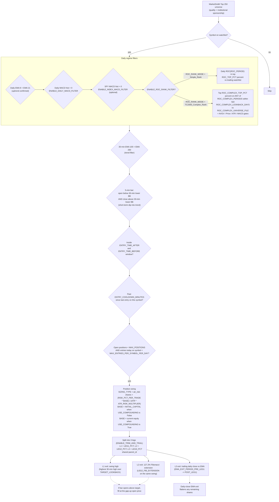

# BB 5-Min Cross — Backtest Engine

Backtest, analysis, and visualisation lab for the BB 5-Min Cross strategy. Sits next to the live IB bot but is **richer** in features (multi-leg trim-and-trail, MACD/ROC/index filters, daily-close EMA exit, ATR-risk sizing, shortlist pre-filter, compounding toggle, gap-up target fills, full HTML reporting). New ideas land here first; only proven ones get promoted to the live bot. See [`../ARCHITECTURE.md`](../ARCHITECTURE.md) for the live-bot doc.

---

## AI Agent Quick Start

If you only have time to read three things, read these:

| Want to … | Open / Edit | Run |
|---|---|---|
| Tweak a strategy knob and see updated HTMLs | [`bt_config.py`](bt_config.py) | `python bt_run.py` (defaults to `MODE = "rerun"` = backtest + report + charts + portfolio) |
| Refresh data from Polygon (slow, ~25 min) | -- | `python bt_run.py download` |
| Iterate fast on the engine (CSVs only, no HTMLs) | [`bt_backtest.py`](bt_backtest.py) | set `MODE = "backtest"` in [`bt_run.py`](bt_run.py) and run |
| Add / change a filter or exit rule | [`bt_backtest.py`](bt_backtest.py) -> `_simulate_one_symbol()` | `python bt_run.py` |
| Change parallelism | [`bt_config.py`](bt_config.py) -> `NUM_WORKERS` (default = `cpu_count() - 1`; set 1 to debug) | -- |
| A/B test entry rules | [`bt_config.py`](bt_config.py) -> `ENTRY_CROSS_MODE` (`"same_bar"` vs `"prev_close"`) | rerun, copy `output/signals.csv` aside between runs |
| Inspect a single trade visually | [`bt_trade_charts.py`](bt_trade_charts.py) | `python bt_run.py charts` (after a backtest run) |
| Add a chart / metric to the report | [`bt_report.py`](bt_report.py) | `python bt_run.py report` |

**Architecture in one paragraph:** [`bt_run.py`](bt_run.py) dispatches stages by name. The engine in [`bt_backtest.py`](bt_backtest.py) prefetches daily data once in the main process to compute cross-symbol inputs (ROC cutoffs, index MACD, trading-day union), then ships a small task tuple per symbol to a `ProcessPoolExecutor` of `NUM_WORKERS`. Each worker re-imports [`bt_config.py`](bt_config.py) on spawn, reloads its own parquet from `data/`, runs the full per-day vectorised simulation for that symbol, and returns trades / signals / shortlist rows. The orchestrator merges, sorts trades by `exit_time`, walks them once to rebuild the equity curve, and writes CSVs. HTML reports read those CSVs in the next stages.

**Two correctness invariants worth remembering:**

1. `USE_COMPOUNDING = False` makes per-symbol sizing independent (`BASE = INITIAL_CAPITAL`), which is what makes per-symbol multiprocessing safe. Setting `USE_COMPOUNDING = True` automatically falls back to `NUM_WORKERS = 1` with a warning -- no behaviour drift.
2. Each worker reads `cfg.ENTRY_CROSS_MODE` fresh on spawn, so toggling that knob actually changes the cross detection rule (no cached `.pyc` quirks). See `_simulate_one_symbol` in [`bt_backtest.py`](bt_backtest.py) line ~360.

---

## 1. Strategy Premise

We invest only in the **highest-quality stocks** that institutional money — funds, hedge funds, mutual funds — is accumulating. The universe is sourced from the **MarketSmith Top 250** list (best earnings growth, best institutional sponsorship, best technical and fundamental ratios), refreshed dynamically.

What we trade is the empirical edge that **trends continue longer than humans expect**. Up-trending stocks tend to keep up-trending. We buy **short-term dips inside longer-term up-trends** in those highest-quality names, and we use moving averages to **give the stock room to breathe** instead of stopping ourselves out of normal noise.

As the move develops we **trim and trail**: take partial profits at fixed levels, then ride the remainder on a moving-average trail so positive outlier moves can drive the asymmetric P&L that pays for the losers.

---

## 2. Decision Engine

### 2.1 Decision flow



### 2.2 Why this approach (advantages)

- **Quality universe lowers blow-up risk.** We never have to pick "what to buy" — the MarketSmith Top 250 has already done the institutional vetting. The strategy only picks **when** to buy.
- **Trend-following inside a quality filter has a long-run positive expectancy.** Trends really do over-extend, especially in stocks that everyone wants to own.
- **Buying dips, not breakouts.** Lower entry price means better risk:reward, less slippage, less giving back on the first pullback.
- **Moving averages give the stock room to breathe.** A daily-close-vs-EMA stop ignores intraday noise and only reacts when the trend itself changes character — fewer death-by-1000-cuts stops.
- **Trim-and-trail produces asymmetric payoffs.** Locking in L1 + L2 turns a high win-rate into a positive expectancy even before L3 hits. L3 alone produces the fat-tailed winners (e.g., +179%, +151%) that make the curve steep.
- **Stack of independent filters keeps us out of bad regimes.** Daily uptrend + 30-min trend + MACD + (optional) index MACD + ROC rank means the bot only fires when **everything** is supportive, not when one indicator is loud.
- **Non-compounding default makes results comparable across years.** A bad year is not punished by a small base; a good year is not flattered by a large one. Compounding is opt-in (`USE_COMPOUNDING = True`).
- **Multi-leg + `parent_id` makes attribution honest.** Per-leg P&L tells you which exit is paying; parent-level analysis tells you which setups work.

### 2.3 Decision factors (what each gate actually reads)

| Decision | Inputs | `bt_config.py` knob |
|---|---|---|
| Universe quality | MarketSmith Top 250 | `WATCHLIST` (`watchlist.txt`) |
| Long-term trend | Daily EMA(8) vs EMA(21) | `UPTREND_FAST_EMA`, `UPTREND_SLOW_EMA` |
| Medium-term trend | 30-min EMA(100) vs EMA(260) | `TREND_FAST_EMA`, `TREND_SLOW_EMA` |
| Momentum confirmation | Daily MACD histogram, daily ROC rank, optional SPY MACD | `ENABLE_DAILY_MACD_FILTER`, `ENABLE_ROC_RANK_FILTER`, `ENABLE_INDEX_MACD_FILTER` |
| ROC rank logic | `Simple_Rank` (per-day percentile vs trading watchlist) or `TC2000_Complex_Rank` (per-day percentile vs external universe over multiple ROC windows, OR'd over a rolling N-day lookback, layered with per-symbol gates) | `ROC_RANK_MODE` |
| Entry timing (mean reversion into trend) | 5-min bar O/C vs 30-min lower BB | `BB_PERIOD`, `BB_STD` |
| Clock band | `09:40` … `13:30` (default) | `ENTRY_TIME_AFTER`, `ENTRY_TIME_BEFORE` |
| Re-entry pacing | Cooldown + per-symbol-per-day cap | `ENTRY_COOLDOWN_MINUTES`, `MAX_ENTRIES_PER_SYMBOL_PER_DAY` |
| Capacity | Total open sub-positions | `MAX_POSITIONS` |
| Position size | ATR-risk: `(RISK_PCT_PER_TRADE × BASE) / (ATR × ATR_RISK_MULTIPLIER)` | `SIZING_TYPE`, `RISK_PCT_PER_TRADE`, `ATR_RISK_MULTIPLIER`, `ATR_RISK_PERIOD` |
| Sizing base (`BASE`) | `INITIAL_CAPITAL` if not compounding, else live equity | `INITIAL_CAPITAL`, `USE_COMPOUNDING` |
| Hard stop | Off in accumulation mode (risk shaped by sizing); when on: session_low − offset | `ENABLE_STOP`, `STOP_TYPE`, `STOP_OFFSET` |
| Profit targets | Swing high (130 × 30-min bars), Fib 1.272 of the same swing | `TARGET_LOOKBACK`, `LEG2_FIB_EXTENSION` |
| Trail | Daily close vs EMA(21) → tightens to EMA(8) after L1 fills | `EMA_EXIT_PERIOD`, `EMA_EXIT_PERIOD_PRE_LEG1`, `EMA_EXIT_PERIOD_POST_LEG1`, `MOVE_STOPS_TO_BE_AFTER_LEG1` |
| Pre-filter (skip uninteresting bars) | Skip bars on green days or far from BB | `ENABLE_SHORTLIST`, `SHORTLIST_REQUIRE_RED`, `SHORTLIST_MAX_DIST_PCT` |

---

## 3. Live vs Backtest Feature Parity

The two implementations now share the same configuration schema and the same decision engine. Differences below are inherent (you can't reconcile a backtest against IB; you can't render an HTML report from live).

| Feature | Live IB bot | Backtest engine |
|---|---|---|
| Single-leg entry / exit | Yes (when `enable_trim_and_trail=False`) | Yes (when `ENABLE_TRIM_AND_TRAIL=False`) |
| Multi-leg trim-and-trail (L1/L2/L3, shared `parent_id`) | **Yes** | Yes |
| Daily-close EMA exit (per-leg `ema_exit_period`) | **Yes** | Yes |
| Clock-band entry window | **Yes** | Yes |
| Daily MACD histogram filter | **Yes** | Yes |
| Index (SPY) MACD filter | **Yes** | Yes |
| Daily ROC rank filter (cross-symbol percentile) | **Yes** | Yes |
| Shortlist pre-filter | **Yes** | Yes |
| Per-symbol cooldown / `max_entries_per_symbol_per_day` | **Yes** | Yes |
| ATR-risk position sizing | **Yes** | Yes |
| Fixed-dollar / percent-equity sizing | Yes | Yes |
| Compounding toggle (`use_compounding`) | **Yes** | Yes |
| Gap-up target fill at bar open | N/A — IB fills at the actual gap-up open | Yes (modelled) |
| Overnight position persistence | **Yes** — always on (`state/open_legs.json` + IB reconcile) | N/A — single-pass simulation |
| Watchlist hot-reload | **Yes** | N/A — single-pass |
| Limit-order entries | **Yes** | No (always fills at signal bar close) |
| Commission tracking | N/A — IB tracks real commissions | Yes (modelled at `COMMISSION_PER_SHARE`) |
| HTML reports + interactive trade charts | N/A — live runtime only | **Yes** (`bt_report.py`, `bt_trade_charts.py`) |

The remaining `N/A` rows are inherent to one side or the other.

---

## 4. Module Overview

```
backtest/
├── bt_config.py             # ALL knobs: filters, exits, sizing, reports, parallelism — single source of truth
├── bt_download.py           # Polygon downloader: incremental cache + partial-bar trim
├── bt_backtest.py           # Engine: vectorised per-symbol simulation, ProcessPoolExecutor across symbols
├── bt_report.py             # HTML reports (summary + deep slice/dice)
├── bt_trade_charts.py       # Interactive per-setup trade charts (Plotly)
├── bt_current_portfolio.py  # current_portfolio.html — open-positions snapshot from trades.csv
├── bt_run.py                # Orchestrator: edit MODE constant, run with no args
├── watchlist.txt            # Stock universe (one symbol per line)
├── data/                    # Parquet cache (one file per symbol × timeframe)
└── output/                  # trades.csv, daily P&L, signals, HTML_Reports/
```

### 4.1 [`bt_config.py`](bt_config.py)

Single source of truth for every tuneable value. Edit here, re-run the relevant `bt_run.py` mode. See §6 for the full knob table.

### 4.2 [`bt_download.py`](bt_download.py)

Polygon.io downloader with **incremental caching**: per (symbol, timeframe) Parquet file in `data/`, only the missing tail is fetched on subsequent runs.

Two correctness features that matter for **mid-day re-runs**:

- **Partial-bar trimming** (`_trim_partial_trailing`) drops any cached row whose bar window has not yet closed. For `daily`, "closed" means after 16:00 ET; for `30min`/`5min`, `bar_start + duration`.
- **Today re-pull**: if the cache touches today's date, the next pull starts at today (not tomorrow), so the previously-incomplete final bar gets overwritten with the complete one.

Together these guarantee that the cache always reflects fully-closed bars, even when you re-run the downloader mid-session.

**Universe expansion for `TC2000_Complex_Rank`.** When `ROC_RANK_MODE = "TC2000_Complex_Rank"`, the downloader also fetches **daily-only** bars for every symbol in `ROC_COMPLEX_UNIVERSE_FILE` (default `watchlist R1000.txt`) that isn't already in `WATCHLIST`, via the new `load_universe()` helper. 30-min and 5-min bars are NOT downloaded for universe-only symbols (the cross-symbol cutoffs only need daily ROC). When `ROC_RANK_MODE = "Simple_Rank"`, the downloader behaves exactly as before -- no universe expansion.

### 4.3 [`bt_backtest.py`](bt_backtest.py)

Core engine. Orchestrator + per-symbol worker, designed for `ProcessPoolExecutor`.

**Orchestrator (`run_backtest()`):**

- Loads parquet for every symbol once, just to grab daily frames.
- Builds four cross-symbol inputs in helpers, then ships them to workers as plain values:
  - `_build_roc_cutoffs(...)` -> `{date: roc_top_pct cutoff}` -- the same percentile every symbol sees. Used by `Simple_Rank` mode.
  - `_build_complex_rank_cutoffs(...)` -> `{period: {date: cutoff}}` -- (100 - `ROC_COMPLEX_TOP_PCT`) percentile across the `ROC_COMPLEX_UNIVERSE_FILE` for each `ROC_COMPLEX_PERIODS` period and date. Returns an empty dict when `ROC_RANK_MODE != "TC2000_Complex_Rank"`, so workers pay zero cost in `Simple_Rank` mode.
  - `_build_index_macd(...)` -> `{date: index_macd_hist}` -- SPY's daily MACD when `ENABLE_INDEX_MACD_FILTER=True`.
  - `_build_trading_days(...)` -> sorted union of all symbols' 5-min trading days inside the date window.
- Dispatches via `ProcessPoolExecutor(max_workers=cfg.NUM_WORKERS)` -- one task per symbol. Auto-falls back to **sequential, in-process** when `cfg.USE_COMPOUNDING=True` (per-symbol equity curves can't be merged afterwards) or when `NUM_WORKERS=1`.
- Merges worker outputs (`trades`, `signals`, `shortlist_rows`), sorts trades by `exit_time`, and walks them once to rebuild the cross-symbol equity curve / drawdown.
- Writes `trades.csv` (or `trades_new.csv` fallback if locked), `signals.csv`, `shortlist.csv`, `strategy_daily_pnl.csv` via the module-level `_safe_csv` helper.

**Per-symbol worker (`_simulate_one_symbol(args)`)** -- runs in its own process. For one symbol, day-by-day:

1. Loads daily / 30-min / 5-min Parquet from `data/`, computes the indicator stack (BB, EMAs, ATR, MACD, ROC).
2. Pre-extracts numpy arrays for OHLC + indicators and `searchsorted` index lookups for daily / 5-min dates -- the inner loop is vectorised, not pandas-row-iterated. **No-look-ahead contract** (covers all three timeframes):
   - **30-min indicators:** all derived columns produced by `_compute_30min` are `shift(1)`-aligned, so row `k` holds the value sealed at the END of bar `k-1`. The worker's `idx_30m_arr = searchsorted(side="left") - 1` mapping then guarantees a 5-min bar at time `t` only reads closed-bar 30-min values.
   - **30-min swing high / low targets:** `_swing_high(m30, idx_30m - 1, ...)` / `_swing_low(m30, idx_30m - 1, ...)` -- the in-progress 30-min bar's high/low is excluded from the swing window.
   - **Daily filter / ROC / SPY MACD / Complex_Rank screen:** daily index resolved with `np.searchsorted(daily_dates, day, side="left") - 1` so the engine reads the **last completed daily bar** (yesterday) at intraday signal time. Per-day cross-symbol dicts (`index_macd_by_day`, `screen_pass_by_day`) are keyed on yesterday's date, not today's.
   
   Combined, no in-progress 30-min bar and no in-progress daily bar ever feeds the entry strategy; backtest filter inputs match what the live bot sees in real time. The `ema_exit` block intentionally evaluates on TODAY's daily EMAs because it is a daily-close decision, not an intraday signal. See §8 for history / details.
3. Applies the daily regime filters (uptrend EMA, MACD, ROC rank vs the cross-symbol cutoff, optional index MACD).
4. **`TC2000_Complex_Rank` precomputation (skipped in `Simple_Rank` mode).** Builds a per-symbol `screen_pass_by_day` boolean dict in three vectorised steps before the bar loop:
   1. `hot_any[i]` -- True iff symbol's `ROC_{p}` is at/above the universe cutoff for at least one `p in ROC_COMPLEX_PERIODS` on day `i`.
   2. `hot_within[i]` -- rolling-OR of `hot_any` over `[i-N+1, i]` (`N = ROC_COMPLEX_LOOKBACK_DAYS`), implemented via the cumulative-sum window trick (same pattern as `had_30m_bullish_cross`).
   3. `gates_pass[i]` -- per-symbol AVGV10 / min price / ATR10% / ATR25% / MACD-positive checks evaluated AS-OF day `i`.
   Then `screen_pass = hot_within & gates_pass`. Days where `screen_pass[i] == False` produce `skip_reason = "complex_rank_filter"` in `signals.csv`.
5. Walks the 5-min bars looking for the BB cross **inside the clock window**, using `cfg.ENTRY_CROSS_MODE`:
   - `"same_bar"`: `bar_open < lower_bb AND bar_close > lower_bb` (default; same logic as the live bot).
   - `"prev_close"`: `prev_close < prev_lower_bb AND cur_close > cur_lower_bb` (classic indicator crossover; catches more setups but with more noise).
6. Applies `ENABLE_SHORTLIST` pre-filter to skip obviously uninteresting bars.
7. Sizes the trade with ATR-risk (`(RISK_PCT_PER_TRADE × BASE) / (ATR × ATR_RISK_MULTIPLIER)`). `BASE = INITIAL_CAPITAL` when `USE_COMPOUNDING=False`, else current equity.
8. Splits into 3 legs sharing a `parent_id`: L1 = swing-high target, L2 = Fib 1.272 target, L3 = EMA-trail.
9. **Gap-up target fill**: when a bar's open is above the target, fills at the open price (captures the gap), not the target itself.
10. **Daily-close EMA exit**: at the daily close, if `close < EMA_EXIT_PERIOD`, flattens all remaining shares of that symbol at the daily close.
11. After L1 fills, the EMA trail tightens from `EMA_EXIT_PERIOD_PRE_LEG1` (21) to `EMA_EXIT_PERIOD_POST_LEG1` (8). Optional move-stop-to-breakeven via `MOVE_STOPS_TO_BE_AFTER_LEG1`.
12. Persists per-leg trade with all entry context (`swing_low_at_entry`, `swing_high_at_entry`, `fib_target_at_entry`, `entry_pct_in_range`, `high_6mo`, `pct_from_6mo_high`) and outcome (`period_held`, `period_held_minutes`, `exit_reason`, `gross_pnl`, `commission`, `net_pnl`, running per-symbol `equity`). Cross-symbol equity is rebuilt by the orchestrator after merge.

### 4.4 [`bt_report.py`](bt_report.py)

Produces two HTML files in `output/HTML_Reports/`:

- **`backtested_trading_analysis.html`** — top-of-funnel: cards (Total Return, CAGR, Sharpe, Max DD, Win Rate, PF, Avg %, Best/Worst, Expectancy, ...), Equity Curve, Drawdown, Daily Returns, **Monthly Return (%) table** (denominator follows `USE_COMPOUNDING`).
- **`analysis.html`** — deep slice / dice:
  - PnL by Leg (L1 / L2 / L3)
  - Entry Position Within Swing Range (parent-level brackets)
  - Entry vs 6-Month High (parent-level brackets)
  - **PnL by 30m BB Squeeze Ratio at Entry** (parent-level brackets) — slices setups by `bb_squeeze_ratio_30m` (current 30m BB width % / trailing-`BB_WIDTH_AVG_LOOKBACK_DAYS`-day mean). Tells you whether trades fired during a squeeze (`<1`) outperform trades fired during expansion (`>1`).
  - **PnL by 30m BB Width vs Daily ATR at Entry** (parent-level brackets) — slices setups by `bb_vs_atr_ratio` (30m BB width % / daily ATR %). Tells you whether intraday volatility being narrow vs wide relative to the daily envelope changes outcomes.
  - PnL by Exit Reason (the lumped `ema_exit` is split into **EMA8 Trail** (post-L1-fill / L3 default) and **EMA21 Stop** (pre-L1-fill default) using the per-leg `ema_exit_period` column at exit time; targets and `open_at_end` shown verbatim with friendlier labels)
  - PnL by Time of Day (30-min buckets, but the opening half-hour is split into `09:30-09:45` and `09:45-10:00` for finer resolution), Day of Week, Week of Month
  - PnL by Recent 30m EMA Cross (Yes / No tag based on `HAD_30M_BULLISH_CROSS_LOOKBACK_BARS`)
  - PnL by Daily ROC decile, MACD histogram quartile
  - Per-Symbol Summary (top + bottom 25 by net P&L)
  - MAE / MFE distribution + capture efficiency scatter
  - What-If Target Sweep (`WHATIF_TARGET_MULTIPLIERS`)

### 4.5 [`bt_trade_charts.py`](bt_trade_charts.py)

`output/HTML_Reports/trade_charts.html` — one interactive card per trade setup. Each card contains:

- **30-min candles** with Bollinger Bands.
- **Daily EMA(8) and EMA(21) overlays** (forward-filled onto 30-min via `merge_asof`) so you can verify the trail visually.
- **Swing geometry**: swing low / swing high / Fib 1.272 target as horizontal lines, plus the Fibonacci range as a coloured band.
- **Per-leg entry / exit markers** with arrows.
- **Setup levels caption** above the chart: `Entry / Stop / Swing low / Swing high / Fib 1.272 (% in range, % vs 6mo high)`.
- **Range slider** at the bottom of the chart for time scrubbing.
- **Legs table** below the chart: Leg, Entry time, Entry $, Shares, Cost, Exit time, Exit $, **Period held**, Reason (refined: `L1 Target (swing high)`, `L2 Target (fib 1.272)`, `L3 Trail (close < EMA8)`, `Full Stop (close < EMA21)`, `Open at backtest end`), Gross P&L, Net P&L, %. Footer row totals shares / cost / overall lifespan / total P&L.

Selection rules (from `bt_config.py`):

- Always include parents whose first entry is within `TRADE_CHARTS_RECENT_DAYS`.
- Plus `TRADE_CHARTS_TOP_N` historic winners and `TRADE_CHARTS_BOTTOM_N` historic losers.
- `SHOW_CLOSED_TRADES_ONLY = True` filters out parents where any leg exited as `open_at_end`.
- `TRADE_CHARTS_CONTEXT_PAD_DAYS` adds calendar pad before/after the trade for context.

### 4.6 [`bt_current_portfolio.py`](bt_current_portfolio.py)

`output/HTML_Reports/current_portfolio.html` -- snapshot of every leg in `trades.csv` whose `exit_reason == "open_at_end"` (i.e. still open at the simulation horizon). Use it to see what the engine *would* be holding if the backtest were the live book.

### 4.7 [`bt_run.py`](bt_run.py)

Orchestrator. The mode is a **top-level constant** at the top of the file -- edit and re-run, no CLI flags needed:

```python
# bt_run.py
MODE = "rerun"   # default; runs backtest + report + charts + portfolio (skips download)

def _dispatch():
    mode = sys.argv[1].lower() if len(sys.argv) > 1 else MODE
    ...

if __name__ == "__main__":   # required for ProcessPoolExecutor on Windows (spawn)
    _dispatch()
```

| `MODE` | Stages run | When to use |
|---|---|---|
| `"download"` | `bt_download` | Refresh Polygon parquet only. Slow (~25 min for ~470 syms). |
| `"backtest"` | `bt_backtest` | Engine pass over existing parquet. Writes CSVs only -- HTMLs are NOT updated. |
| `"report"` | `bt_report` | Re-render `analysis.html` + `backtested_trading_analysis.html` from `trades.csv`. |
| `"charts"` | `bt_trade_charts` | Re-render `trade_charts.html` from `trades.csv`. |
| `"portfolio"` | `bt_current_portfolio` | Re-render `current_portfolio.html` from `trades.csv`. |
| `"rerun"` (default) | `bt_backtest` -> `bt_report` -> `bt_trade_charts` -> `bt_current_portfolio` | **Iterating on config.** Refreshes everything you need to see; never re-downloads. |
| `"full"` | `bt_download` -> `bt_backtest` -> `bt_report` -> `bt_trade_charts` -> `bt_current_portfolio` | First-time setup or when data is stale. |

CLI override is still available for one-offs:

```bash
python bt_run.py            # uses MODE constant (default: "rerun")
python bt_run.py download   # one-shot override, MODE constant ignored
python bt_run.py full       # one-shot override
```

---

## 5. Outputs

All paths under `backtest/output/`.

| File | Producer | Contents |
|---|---|---|
| `trades.csv` | `bt_backtest.py` | One row per leg. Columns: `date`, `symbol`, `parent_id`, `leg`, entry context (`entry_time`, `entry_price`, `swing_low_at_entry`, `swing_high_at_entry`, `fib_target_at_entry`, `entry_pct_in_range`, `high_6mo`, `pct_from_6mo_high`, `daily_roc`, `daily_macd_hist`, `daily_atr_pct`, `day_of_week`, `entry_hhmm`, `had_30m_bullish_cross` -- True if a bullish 30-min EMA cross occurred within the last `HAD_30M_BULLISH_CROSS_LOOKBACK_BARS` bars at entry time, **volatility regime at entry**: `bb_width_pct_30m` (current 30m BB width as % of price), `bb_width_pct_30m_avg` (trailing-`BB_WIDTH_AVG_LOOKBACK_DAYS`-day mean of `bb_width_pct_30m`), `bb_squeeze_ratio_30m` = `bb_width_pct_30m` / `bb_width_pct_30m_avg` (<1 = squeeze, >1 = expansion), `bb_vs_atr_ratio` = `bb_width_pct_30m` / `daily_atr_pct` (intraday vs daily vol comparison)), sizing (`shares`, `position_value`, `risk_dollars` = per-leg share of parent budget, `parent_risk_dollars` = full per-trade budget), targets/trail (`target_kind`, `target_price`, `ema_exit_period`), outcome (`exit_time`, `exit_price`, `exit_reason`, `gross_pnl`, `commission`, `net_pnl`, `mae_pct`, `mfe_pct`, `period_held`, `period_held_minutes`, running `equity`). **Risk semantics**: `risk_dollars` is now the leg's proportional share of the parent's ATR-risk budget (so legs of one parent sum to `parent_risk_dollars`). `parent_risk_dollars = INITIAL_CAPITAL x RISK_PCT_PER_TRADE / 100` (or live equity x ... when `USE_COMPOUNDING=True`). Naive `df["risk_dollars"].sum()` previously over-reported by `n_legs` -- it now equals total cumulative risk across distinct trades. |
| `trades_new.csv` | fallback in `_safe_csv` when `trades.csv` is locked (Excel, file viewer). Promote manually with `os.replace`. |
| `strategy_daily_pnl.csv` | per trading day: `date`, `daily_pnl`, `equity`, `open_positions`, `cumulative_pnl`, `drawdown_pct`. |
| `signals.csv` | one row per detected BB cross (passes and skips both). Columns: `date`, `symbol`, `signal_time`, bar inputs (`bar_open`, `bar_close`, `bar_high`, `bar_low`, `lower_bb`), 30-min indicators (`ema100_30m`, `ema200_30m`), daily indicators (`daily_atr_{ATR_RISK_PERIOD}`, `daily_macd_hist`, `index_macd_hist`, `daily_roc_{ROC_PERIOD}`, `daily_roc_cutoff`), prior-bar snapshot (`prev_close`, `prev_lower_bb` -- populated in **both** modes for audit), `entry_cross_mode` (which rule actually fired the cross: `"same_bar"` or `"prev_close"`), `had_30m_bullish_cross` (True if a bullish 30-min EMA cross occurred within the last `HAD_30M_BULLISH_CROSS_LOOKBACK_BARS` bars at signal time -- recorded on every signal whether the entry executes or not), `roc_rank_mode` (the active mode: `"Simple_Rank"` or `"TC2000_Complex_Rank"`), `complex_rank_pass` (True / False when `ROC_RANK_MODE = "TC2000_Complex_Rank"`; empty in `Simple_Rank` mode), **volatility regime at signal time**: `bb_width_pct_30m`, `bb_width_pct_30m_avg`, `bb_squeeze_ratio_30m`, `daily_atr_pct`, `bb_vs_atr_ratio` (recorded on every signal -- pass or skip -- so squeeze/expansion behavior can be analyzed even on entries the engine declined), `traded` (bool), `skip_reason` (`"clock"`, `"shortlist_*"`, `"daily_uptrend"`, `"daily_macd_filter"`, `"index_macd_filter"`, `"roc_rank_filter"` (Simple), `"complex_rank_filter"` (TC2000), `"trend_30m"`, `"below_30m_ema"`, `"atr_unavailable"`, `"max_entries_per_symbol_per_day"`, `"max_positions"`, `"cooldown"`, `"no_recent_30m_cross"`). Daily-derived columns are explicitly prefixed `daily_*` so the timeframe is unambiguous; 30-min indicators carry the `_30m` suffix. |
| `shortlist.csv` | bars that passed the shortlist pre-filter. |
| `HTML_Reports/backtested_trading_analysis.html` | `bt_report.py` | Top-level summary report. |
| `HTML_Reports/analysis.html` | `bt_report.py` | Deep slice/dice. |
| `HTML_Reports/trade_charts.html` | `bt_trade_charts.py` | Interactive per-setup charts. |

---

## 6. `bt_config.py` Reference

### Polygon API

| Knob | Default | Purpose |
|---|---|---|
| `POLYGON_API_KEY` | env `POLYGON_API_KEY` | API token for data downloads |
| `RATE_LIMIT_SLEEP` | `0.10` | Seconds between API calls |
| `MAX_RETRIES` | `3` | Per-request retry count |

### Date range

| Knob | Default | Purpose |
|---|---|---|
| `END_DATE` | `today()` | Last day to simulate |
| `START_DATE` | `END_DATE − 365d` | First day to simulate |
| `WARMUP_DAILY_BARS` | `220` | Extra daily bars before `START_DATE` (EMA warmup) |
| `WARMUP_INTRADAY_DAYS` | `23` | Extra intraday days for 30-min indicator warmup |

### Strategy filters

| Knob | Default | Purpose |
|---|---|---|
| `BB_PERIOD`, `BB_STD` | `20`, `2.0` | 30-min Bollinger Band on `SCREENING_TF` |
| `SCREENING_TF` | `"30min"` | Timeframe for the BB / trend stack |
| `TREND_FAST_EMA`, `TREND_SLOW_EMA` | `100`, `260` | 30-min trend filter |
| `HAD_30M_BULLISH_CROSS_LOOKBACK_BARS` | `130` | How far back (in 30-min bars; 130 ≈ 10 trading days) to look for a recent bullish cross of `TREND_FAST_EMA` over `TREND_SLOW_EMA`. Tag is recorded on every trade as `had_30m_bullish_cross`. |
| `ENABLE_RECENT_30M_CROSS_FILTER` | `False` | When `True`, reject entries where no bullish 30-min EMA cross occurred inside the lookback window (`skip_reason = "no_recent_30m_cross"`). When `False` (default), the boolean is recorded on every trade for analysis only. |
| `UPTREND_FAST_EMA`, `UPTREND_SLOW_EMA` | `8`, `21` | Daily uptrend filter |
| `ENABLE_DAILY_MACD_FILTER` | `True` | Require daily MACD hist > 0 on entry day |
| `MACD_FAST`, `MACD_SLOW`, `MACD_SIGNAL` | `12`, `26`, `9` | MACD periods |
| `ENABLE_INDEX_MACD_FILTER` | `False` | Require `INDEX_SYMBOL` daily MACD hist > 0 |
| `INDEX_SYMBOL` | `"SPY"` | Benchmark for index MACD filter |
| `ENABLE_ROC_RANK_FILTER` | `True` | Master on/off for the ROC rank gate. When `False`, every signal that passes other filters fires (no ROC ranking). |
| `ROC_RANK_MODE` | `"Simple_Rank"` | Selector for the ranking logic when `ENABLE_ROC_RANK_FILTER = True`. Must be `"Simple_Rank"` or `"TC2000_Complex_Rank"`. |
| `ROC_PERIOD`, `ROC_TOP_PCT` | `60`, `75.0` | `Simple_Rank` knobs: daily ROC lookback + top-percentile cutoff vs the trading watchlist. |
| `ROC_COMPLEX_PERIODS` | `[5, 10, 30]` | `TC2000_Complex_Rank`: ROC windows ranked independently then OR'd. |
| `ROC_COMPLEX_TOP_PCT` | `5.41` | `TC2000_Complex_Rank`: top X% per ROC window vs the universe (default mirrors TC2000 `100 - 94.59`). |
| `ROC_COMPLEX_LOOKBACK_DAYS` | `20` | `TC2000_Complex_Rank`: rolling lookback. Symbol passes if it was hot on **any** day in the last N (matches TC2000's `Within Bars 20`). |
| `ROC_COMPLEX_UNIVERSE_FILE` | `watchlist R1000.txt` | `TC2000_Complex_Rank`: file with the ranking universe (one ticker per line; `#` and blank lines ignored). Universe-only symbols are downloaded daily-only by `bt_download.py`. |
| `ROC_COMPLEX_REQUIRE_AVGV10` | `300_000` | `TC2000_Complex_Rank` per-symbol gate: rolling mean(volume, 10) on the entry day. |
| `ROC_COMPLEX_REQUIRE_MIN_PRICE` | `3.0` | `TC2000_Complex_Rank` per-symbol gate: minimum daily close. |
| `ROC_COMPLEX_REQUIRE_ATR10_PCT` | `3.0` | `TC2000_Complex_Rank` per-symbol gate: `ATR(10) / close * 100` minimum. |
| `ROC_COMPLEX_REQUIRE_ATR25_PCT` | `3.0` | `TC2000_Complex_Rank` per-symbol gate: `ATR(25) / close * 100` minimum. |
| `ROC_COMPLEX_REQUIRE_MACD_POS` | `True` | `TC2000_Complex_Rank` per-symbol gate: daily `MACD_HIST > 0` (overlaps with `ENABLE_DAILY_MACD_FILTER` -- harmless). |
| `ATR_PERIOD` | `7` | Daily ATR period (for display + sizing fallback) |
| `BB_WIDTH_AVG_LOOKBACK_DAYS` | `10` | Trailing-mean lookback for `bb_squeeze_ratio_30m` (current 30m BB width % / mean BB width % over the last N days). Audit-only knob: drives the new "PnL by 30m BB Squeeze Ratio at Entry" bracket section in `analysis.html` and the `bb_*` columns persisted on every signal / trade. |
| `BB_WIDTH_BARS_PER_DAY` | `13` | Used internally to convert `BB_WIDTH_AVG_LOOKBACK_DAYS` into 30-min bars for the rolling mean (regular RTH session = 13 30-min bars). Adjust if you change `SCREENING_TF`. |

> **`ROC_COMPLEX_LOOKBACK_DAYS` semantics.** The "in the top X%" check is rolling, not just-today. Per day `i`, the symbol is `hot_any[i]` iff its `ROC_{p}` cleared the universe cutoff on day `i` for at least one `p in ROC_COMPLEX_PERIODS`. The screen then asks: was the symbol `hot_any` on **any** day in the inclusive window `[i - N + 1, i]`, where `N = ROC_COMPLEX_LOOKBACK_DAYS`? If yes (and the per-symbol AVGV / price / ATR / MACD gates also pass on day `i`), the symbol is allowed to trade on day `i`. So a stock that ripped to the top 5% three days ago and has since pulled back is still tradeable today; a stock that has been quiet for 25+ days is not. The per-symbol gates are evaluated AS-OF the entry day only (TC2000's `Within Bars 20` only applies to the ROC ranks).

### Entry

| Knob | Default | Purpose |
|---|---|---|
| `ENTRY_TF` | `"5min"` | Timeframe of the entry trigger bar |
| `ENTRY_TIME_AFTER` | `"09:30"` | Reject entries at/before this clock time |
| `ENTRY_TIME_BEFORE` | `"13:30"` | Reject entries after this clock time |
| `ENABLE_BELOW_30M_EMA` | `False` | Optional pullback gate (bar_close ≤ EMA(`BELOW_30M_EMA_PERIOD`)) |
| `BELOW_30M_EMA_PERIOD` | `72` | Reuses `TREND_FAST_EMA` column |
| `ENTRY_CROSS_MODE` | `"prev_close"` (backtest); `"same_bar"` (live `strategy_config.py`) | BB-cross definition. `"same_bar"` = `bar_open < lower_bb AND bar_close > lower_bb` (single-bar traversal of the band; live-bot default). `"prev_close"` = `prev_close < prev_lower_bb AND cur_close > cur_lower_bb` (classic indicator crossover; catches more setups, more noise -- backtest default). Defaults differ across the two engines because the backtest is currently exploring `prev_close`; toggle to `"same_bar"` for byte-identical parity with live. |

### Exits

| Knob | Default | Purpose |
|---|---|---|
| `ENABLE_STOP` | `False` | Per-trade hard stop (off in accumulation mode) |
| `STOP_TYPE`, `STOP_OFFSET` | `"session_low"`, `0.01` | Session-low minus offset when enabled |
| `ENABLE_TARGET` | `True` | Take-profit at swing high |
| `TARGET_TYPE`, `TARGET_LOOKBACK` | `"swing_high"`, `130` | Highest 30-min high over N bars |
| `ENABLE_EOD_FLATTEN` | `False` | Flatten everything on the last 5-min bar of each day |
| `ENABLE_EMA_EXIT` | `True` | Daily-close < EMA → flatten remaining shares |
| `EMA_EXIT_PERIOD` | `21` | Single-leg / fallback EMA |

### Trim-and-trail

| Knob | Default | Purpose |
|---|---|---|
| `ENABLE_TRIM_AND_TRAIL` | `True` | Split each entry into 3 legs |
| `LEG1_PCT`, `LEG2_PCT`, `LEG3_PCT` | `0.33`, `0.33`, `0.34` | Leg size fractions (remainder → L3) |
| `LEG2_FIB_EXTENSION` | `1.272` | L2 target = `swing_low + EXT × (swing_high − swing_low)` |
| `MOVE_STOPS_TO_BE_AFTER_LEG1` | `False` | Move sibling stops to breakeven after L1 fills |
| `EMA_EXIT_PERIOD_PRE_LEG1` | `21` | Trail EMA before L1 fills |
| `EMA_EXIT_PERIOD_POST_LEG1` | `8` | Tighter trail EMA after L1 fills |

### Shortlist

| Knob | Default | Purpose |
|---|---|---|
| `ENABLE_SHORTLIST` | `True` | Skip uninteresting bars before evaluating filters |
| `SHORTLIST_REQUIRE_RED` | `True` | Skip bars where `bar_close ≥ day_open` (stock is green) |
| `SHORTLIST_MAX_DIST_PCT` | `5.0` | Skip bars where `bar_low > lower_bb × (1 + pct/100)` |

### Position sizing

| Knob | Default | Purpose |
|---|---|---|
| `INITIAL_CAPITAL` | `100_000` | Starting equity, also the sizing base when `USE_COMPOUNDING=False` |
| `SIZING_TYPE` | `"atr_risk"` | `atr_risk`, `fixed_dollar`, or `percent_equity` |
| `SIZING_AMOUNT` | `500.0` | Dollars per entry (used only by `fixed_dollar` / `percent_equity`) |
| `RISK_PCT_PER_TRADE` | `0.5` | % of base risked per entry (atr_risk) |
| `ATR_RISK_MULTIPLIER` | `1.0` | Risk-per-share = multiplier × ATR(period) |
| `ATR_RISK_PERIOD` | `7` | Daily ATR lookback for sizing |
| `MAX_POSITIONS` | `100000` | Total open sub-positions across all symbols |
| `MAX_ENTRIES_PER_SYMBOL_PER_DAY` | `10` | Per-symbol cap |
| `ENTRY_COOLDOWN_MINUTES` | `30` | Min minutes between entries on same symbol |
| `USE_COMPOUNDING` | `False` | When `False`, sizing always uses `INITIAL_CAPITAL` |

> **Risk-budget semantics.** `RISK_PCT_PER_TRADE` is the budget for the **whole parent trade**, not per leg. `_position_size()` computes `total_shares = (BASE x RISK_PCT) / (ATR_MULT x ATR)` once, then `total_shares` is split across legs by `LEG1_PCT / LEG2_PCT / LEG3_PCT`. So a 3-leg trade with `RISK_PCT_PER_TRADE = 0.3` and `INITIAL_CAPITAL = 100_000` risks **$300 total**, distributed roughly 1/3 / 1/3 / 1/3 across legs. In `trades.csv`, `risk_dollars` is the per-leg share (legs sum to the parent budget) and `parent_risk_dollars` is the full $300 budget repeated on every leg row. Total parent risk does NOT scale with the number of legs.

### Commission

| Knob | Default | Purpose |
|---|---|---|
| `COMMISSION_PER_SHARE` | `0.003` | Per-share round-trip commission |

### Parallel execution

| Knob | Default | Purpose |
|---|---|---|
| `NUM_WORKERS` | `max(1, cpu_count() - 1)` | Process workers in `bt_backtest.run_backtest`. Set to `1` to force the legacy single-process path (debugging or byte-identical parity comparisons). **Auto-falls back to 1 (with warning) when `USE_COMPOUNDING=True`** -- compounded sizing depends on the cross-symbol equity curve and cannot be parallelised per-symbol without behavioural drift. |

### Trade charts

| Knob | Default | Purpose |
|---|---|---|
| `TRADE_CHARTS_RECENT_DAYS` | `30` | Always include parents from the last N calendar days |
| `TRADE_CHARTS_TOP_N` | `5` | Plus N historic winners |
| `TRADE_CHARTS_BOTTOM_N` | `5` | Plus N historic losers |
| `TRADE_CHARTS_CONTEXT_PAD_DAYS` | `5` | Calendar pad before entry / after last exit |
| `SHOW_CLOSED_TRADES_ONLY` | `False` | True = exclude parents with `open_at_end` legs |
| `TRADE_CHARTS_FILENAME` | `"trade_charts.html"` | Output filename |

### Report — what-if sweep

| Knob | Default | Purpose |
|---|---|---|
| `WHATIF_TARGET_MULTIPLIERS` | `[1.0, 1.1, 1.2, 1.272, 1.5, 1.618, 2.0]` | Target multipliers for the MFE-based what-if simulation |

---

## 7. Running the Backtest

```bash
# Install dependencies (from repo root)
pip install -r requirements.txt

# Edit knobs
# Open backtest/bt_config.py

# Edit watchlist
# Open backtest/watchlist.txt -- one symbol per line

# Default: edit MODE in bt_run.py (default "rerun") and run with no args
cd backtest
python bt_run.py                # uses MODE constant (default: rerun = backtest+report+charts+portfolio, no download)

# One-shot CLI overrides (bypass the MODE constant for one run)
python bt_run.py full           # download + backtest + report + charts + portfolio
python bt_run.py download       # only refresh Parquet cache
python bt_run.py backtest       # rerun engine on cached data (CSVs only)
python bt_run.py report         # only re-render analysis HTMLs
python bt_run.py charts         # only re-render trade_charts.html
python bt_run.py portfolio      # only re-render current_portfolio.html
```

### Common gotchas

- **`trades.csv` locked by Excel** -> `bt_backtest.py` falls back to `trades_new.csv` and prints `WARNING: trades.csv locked, saved as trades_new.csv`. Close the file in Excel and `os.replace('output/trades_new.csv', 'output/trades.csv')` before re-rendering.
- **Mid-day re-runs** -> `bt_download.py` already handles partial-bar trimming and re-pulls today's bars. No special action needed.
- **Stale charts after a config flip** -> If you toggled (e.g.) `MOVE_STOPS_TO_BE_AFTER_LEG1`, you need a fresh backtest, not just a chart re-render. The chart only reflects what's in `trades.csv`. Use `MODE = "rerun"` (the default) so the HTMLs are regenerated automatically after every backtest.
- **`MODE = "backtest"` does NOT update HTML reports** -> by design (fast iteration). Use `"rerun"` if you want CSVs *and* HTMLs.
- **`ProcessPoolExecutor` import errors / silent fork on Windows** -> ensure you keep the `if __name__ == "__main__":` guard at the bottom of `bt_run.py`. Without it, every worker re-runs the dispatcher and you'll see infinite recursion or import errors.
- **Comparing `ENTRY_CROSS_MODE` runs** -> `signals.csv` and `trades.csv` are overwritten on every run. Copy them aside (`trades_same_bar.csv`, `trades_prev_close.csv`) between runs to A/B compare.

---

## 8. Recently Shipped

Latest sprint (most recent first):

- **No-look-ahead daily filters and swing targets.** Closes the two known remaining intra-bar look-ahead surfaces flagged in the previous bullet. Four surgical changes in `_simulate_one_symbol` (`bt_backtest.py`):
  1. Daily-row index `d_idx = np.searchsorted(daily_dates, day, side="left") - 1` (was `side="right" - 1`). At intraday signal time on day `D`, the engine now reads the **last completed daily bar** (`D-1`) for `close`, `EMA_{UPTREND_FAST_EMA}`, `EMA_{UPTREND_SLOW_EMA}`, `MACD_HIST`, `ATR_{ATR_RISK_PERIOD}`, `roc_{ROC_RANK_PERIOD}`, and the per-day ROC cutoff -- exactly what the live bot sees, since today's daily bar physically does not exist intraday.
  2. `index_macd_by_day` lookup keyed by `daily_dates[d_idx]` (yesterday) instead of `day` (today), so the SPY MACD regime gate also reads the last-closed daily SPY bar.
  3. `screen_pass_by_day` (TC2000 Complex_Rank) lookup keyed the same way; fail-safe to `False` when no prior daily date exists (e.g., warm-up edge case) so the screen never silently bypasses.
  4. `_swing_high(m30, idx_30m - 1, ...)` and `_swing_low(m30, idx_30m - 1, ...)` -- the swing-target window now excludes the in-progress 30-min bar's high/low, only consulting fully-closed 30-min bars (mirrors the indicator-side `shift(1)` contract).
  
  Carve-out: the `ema_exit` block intentionally evaluates on TODAY's daily EMAs because that branch only runs at end-of-day to flatten positions on a daily-trend break; that is not a look-ahead -- it's a daily-close decision.
  
  Empirical impact (verified on `AAPL 2026-04-21` via `_dbg_aapl.py`): yesterday vs today filter inputs shifted materially -- `MACD_HIST` 2.07 vs 1.71, `ROC_60` 9.72 vs 7.31, `ROC_30` 5.84 vs 2.42 -- and two BB crosses that were previously suppressed by the (look-ahead) Complex_Rank gate now correctly fire because yesterday's higher ROCs pass the screen at intraday time. Swing high/low delta was 0 on this particular day (the in-progress 30m bar didn't extend the 130-bar window's max/min), but the contract is enforced for every day going forward. **Net effect on `signals.csv` / `trades.csv`:** `daily_*` numeric columns now carry yesterday's values (not today's); `complex_rank_pass` is yesterday-as-of, not today-as-of; `swing_high_at_entry` / `swing_low_at_entry` / `fib_target_at_entry` / `entry_pct_in_range` may shift on bars where the in-progress 30m bar would have set a new window extreme. Re-run a full backtest to refresh -- past CSVs are stale.

- **No-look-ahead 30-min indicators.** `_compute_30min` in `bt_backtest.py` now applies `.shift(1)` to every derived 30-min column (`EMA_{TREND_FAST_EMA}`, `EMA_{TREND_SLOW_EMA}`, `BB_LOWER`, `BB_UPPER`, `BB_WIDTH_PCT`, `BB_WIDTH_PCT_AVG`, `BB_SQUEEZE_RATIO`), and `BB_WIDTH_PCT` is normalized by `close.shift(1)` so the width % isn't divided by a future price either. New contract: row `k` holds the indicator value as KNOWN AT THE START of bar `k` (= as of the END of the most recent fully-closed bar `k-1`). Combined with the worker's existing `idx_30m_arr = searchsorted(side="left") - 1` mapping, every intraday 5-min bar now reads strictly closed-bar 30-min values -- no in-progress bar ever feeds the strategy. Pre-fix, ~10 of every 12 5-min bars in a 30-min window were reading indicators that already incorporated the close of the in-progress 30-min bar (verified empirically on `CGNX 2024-09-30 14:30`: stored `BB_LOWER` was `40.084` -- the value that includes bar k's close -- vs the no-look-ahead value `40.022`, a `~0.15%` shift relative to price). Restores parity with the live bot, which has always read indicators via `get_last_closed_bar_index` (see [`ARCHITECTURE.md`](../ARCHITECTURE.md) §8 / `data_manager.py`). Backtest results will move (typically fewer / later signals on bars that previously crossed against an in-progress `BB_LOWER`); this is the intended behavior. **Known remaining intra-bar look-ahead at the time of this fix -- both subsequently CLOSED by the next bullet up ("No-look-ahead daily filters and swing targets"):** (1) `_swing_high` / `_swing_low` were still reading raw `m30["high"]` / `m30["low"]` at `idx_30m_arr[i]` (the in-progress 30-min bar); (2) `daily.iloc[d_idx]` was reading today's daily row, so today's daily close, daily EMAs, ATR, `MACD_HIST`, ROC were all forward-looking relative to intraday bars. Both are now eliminated.
- **Volatility regime tracking at entry (audit-only).** Five new percentage-based columns are now persisted on every `signals.csv` row and every `trades.csv` leg row: `bb_width_pct_30m` (current 30-min Bollinger Band width as a % of price), `bb_width_pct_30m_avg` (trailing-`BB_WIDTH_AVG_LOOKBACK_DAYS`-day mean), `bb_squeeze_ratio_30m` (= current / mean; <1 = squeeze, >1 = expansion), `daily_atr_pct` (= daily ATR / daily close * 100, also added to `signals.csv`), and `bb_vs_atr_ratio` (= `bb_width_pct_30m` / `daily_atr_pct`; intraday vs daily vol comparison). Implementation: `_compute_30min` in `bt_backtest.py` adds `BB_WIDTH_PCT`, `BB_WIDTH_PCT_AVG` (rolling-mean over `BB_WIDTH_AVG_LOOKBACK_DAYS * BB_WIDTH_BARS_PER_DAY` 30-min bars), `BB_SQUEEZE_RATIO` once per symbol; `_simulate_one_symbol` pre-resolves them per 5-min bar and broadcasts the day's `daily_atr_pct` to compute `bb_vs_atr_ratio`. Two new parent-level bracket sections in `analysis.html`: **PnL by 30m BB Squeeze Ratio at Entry** (buckets at `<0.7 / 0.7-0.9 / 0.9-1.1 / 1.1-1.5 / >1.5`) and **PnL by 30m BB Width vs Daily ATR at Entry** (buckets at `<0.5 / 0.5-1.0 / 1.0-1.5 / 1.5-2.5 / >2.5`). Two new knobs in `bt_config.py`: `BB_WIDTH_AVG_LOOKBACK_DAYS = 10` and `BB_WIDTH_BARS_PER_DAY = 13`. **No entry filter** -- pure audit, so existing trade selection is byte-identical.
- **`TC2000_Complex_Rank` ROC mode (backtest-only).** New `ROC_RANK_MODE` selector in `bt_config.py` switches between the existing `Simple_Rank` (default; unchanged behavior) and a new `TC2000_Complex_Rank` mode that mirrors the `screenConditionEOD.txt` TC2000 EOD screen: per-day percentile cutoffs are computed against an external universe (`ROC_COMPLEX_UNIVERSE_FILE`, default `watchlist R1000.txt`) over multiple ROC windows (`ROC_COMPLEX_PERIODS = [5, 10, 30]`); a symbol is "hot" if it cleared the top `ROC_COMPLEX_TOP_PCT %` on **any** of those windows on **any** day in the trailing `ROC_COMPLEX_LOOKBACK_DAYS` (default 20). Layered with per-symbol AVGV10 / min price / ATR10% / ATR25% / MACD-positive gates evaluated AS-OF the entry day. Implementation: `bt_download.py` extended with a `load_universe()` helper to fetch daily-only bars for universe-only symbols; `_build_complex_rank_cutoffs(...)` in `bt_backtest.py` precomputes `{period: {date: cutoff}}` once in the main process; per-symbol workers vectorise the screen via `hot_within = rolling-OR(hot_any, N)` (cumsum trick) AND `gates_pass`. New `signals.csv` audit columns: `roc_rank_mode` and `complex_rank_pass`; new `skip_reason = "complex_rank_filter"`. `Simple_Rank` mode is byte-identical to before -- workers receive an empty cutoffs dict and the existing code path runs unchanged. Live bot is **not** updated for this mode yet (see `ARCHITECTURE.md` §3).
- **`PnL by Exit Reason` now splits `ema_exit` into EMA8 Trail vs EMA21 Stop.** The engine still writes a single `"ema_exit"` to `trades.csv`, but `bt_report.py` now derives a refined label at report time using the per-leg `ema_exit_period` column (which `_close_position` already persists via `{**position}` and which is mutated to `EMA_EXIT_PERIOD_POST_LEG1` when L1 fills). Result: the L3 / 8-EMA trail is finally visible as its own row, separate from the L1/L2 21-EMA stops. Targets (`L1 Target (swing high)`, `L2 Target (fib 1.272)`) and `Open at backtest end` also get friendlier labels. **No re-backtest required** — works on existing `trades.csv` rows; only stale CSVs missing the `ema_exit_period` column fall back to "EMA Exit (period n/a)".
- **30-min EMA-cross-in-last-N-bars tag + optional filter.** New `had_30m_bullish_cross` boolean is precomputed per symbol via a vectorised cumulative-sum window over `(EMA_FAST > EMA_SLOW) & (prev EMA_FAST <= prev EMA_SLOW)` on the 30-min series, then attached to every entry (so it lands on every leg row in `trades.csv`) and to every BB-cross row in `signals.csv`. Two new knobs in `bt_config.py`: `HAD_30M_BULLISH_CROSS_LOOKBACK_BARS` (default `130` ≈ 10 trading days) and `ENABLE_RECENT_30M_CROSS_FILTER` (default `False` -- tag only). When the filter is `True`, missing-cross entries are skipped with `skip_reason = "no_recent_30m_cross"`. New "PnL by Recent 30m EMA Cross" section in `analysis.html` slices Yes vs No so you can see whether fresh-trend setups outperform stale-trend setups before promoting it to a hard filter.
- **Time-of-day buckets in `analysis.html` split the opening half-hour.** `_bucket_time_of_day` now special-cases `09:30-09:44` -> `09:30` and `09:45-09:59` -> `09:45` while leaving the rest of the day on 30-min buckets. Sort order remains alphabetical (string `HH:MM`), so the new buckets slot in cleanly: `09:30 < 09:45 < 10:00 < 10:30 < ...`.
- **`signals.csv` schema clarified.** New columns: `entry_cross_mode` (records which BB-cross rule fired), `prev_close` and `prev_lower_bb` (the prior closed bar's snapshot, populated in **both** modes for audit). Daily-derived columns renamed with explicit `daily_` prefix: `roc_{period}` -> `daily_roc_{period}`, `roc_cutoff` -> `daily_roc_cutoff`, `macd_hist` -> `daily_macd_hist`, `atr7` -> `daily_atr_{ATR_RISK_PERIOD}`. 30-min indicators already carried `_30m`. Reading `signals.csv` is now timeframe-unambiguous.
- **`trades.csv` `risk_dollars` is now per-leg.** Previously each leg row duplicated the full parent-trade risk budget, so `df["risk_dollars"].sum()` over a multi-leg trade reported 3x the actual capital at risk. Per-leg value is now `parent_risk_dollars * leg_shares / total_shares`, so legs of one parent sum back to the parent budget. New `parent_risk_dollars` column carries the full per-trade ATR-risk budget on every leg row. **Sizing math is unchanged** -- only the column attribution changed; trade share counts, entries, exits, and net P&L are identical to before.
- **`MODE = "rerun"` is the new default in `bt_run.py`.** Edit the top-level `MODE` constant in `bt_run.py` -- no CLI flags needed. `"rerun"` runs `backtest -> report -> charts -> portfolio` so HTMLs always reflect the latest config without re-downloading data. CLI override (`python bt_run.py download`, etc.) still works for one-offs.
- **Per-symbol multiprocessing** in `bt_backtest.run_backtest()`. Workers share cross-symbol inputs (ROC cutoffs, index MACD, trading-day union) but each runs `_simulate_one_symbol(...)` independently. `NUM_WORKERS` knob in `bt_config.py` (defaults to `cpu_count() - 1`). Auto-falls back to sequential when `USE_COMPOUNDING=True`.
- **Vectorised hot loop in `_simulate_one_symbol`.** OHLC + indicators pre-extracted as numpy arrays; `searchsorted` for daily / 5-min date lookups; running session-low computed once per day. ~10x speedup vs the prior `iterrows`-style loop.
- **`ENTRY_CROSS_MODE` knob** (in both `bt_config.py` and `strategy_config.py`). Choose `"same_bar"` (open<bb AND close>bb on the same bar; live-bot default) or `"prev_close"` (`prev_close < prev_lower_bb AND cur_close > cur_lower_bb`; classic indicator crossover). Lets you A/B test cross definitions without code changes. Live bot stores per-symbol `prev_entry_close` / `prev_entry_lower_bb` on `Context` for the `prev_close` mode.
- **Windows multiprocessing safety**: `bt_run.py` wraps dispatch in `_dispatch()` under `if __name__ == "__main__":` so spawned workers don't re-run the orchestrator.
- **Module-level `_safe_csv` helper** -- handles the `trades.csv` -> `trades_new.csv` fallback for every CSV writer in `bt_backtest.py` consistently.
- **Monthly Return (%) table** in `backtested_trading_analysis.html` replaces the old dollar table. Denominator is `INITIAL_CAPITAL` when `USE_COMPOUNDING=False` (constant base, all years comparable), or prior month's end-of-month equity when compounding (geometric chain for the year-total).
- **`USE_COMPOUNDING=False` now truly disables compounding.** Sizing base is `INITIAL_CAPITAL` for every entry. Previously, `day_start_equity` was still updated day-over-day, silently compounding.
- **Mid-day partial-bar trimming** in `bt_download.py` (`_trim_partial_trailing`) so re-runs always overwrite incomplete bars.
- **Range slider** on `trade_charts.html` for time scrubbing through the chart context window.
- **Setup levels caption** above each chart card: `Entry / Stop / Swing low / Swing high / Fib 1.272 (% in range, % vs 6mo high)`.
- **Swing-range and 6-month-high persisted at entry** (`swing_low_at_entry`, `swing_high_at_entry`, `fib_target_at_entry`, `entry_pct_in_range`, `high_6mo`, `pct_from_6mo_high` columns in `trades.csv`).
- **Two new bracket sections in `analysis.html`**: *Entry Position Within Swing Range* and *Entry vs 6-Month High*, both at parent level so multi-leg setups are counted once.
- **`period_held` / `period_held_minutes`** persisted on every leg; the trade-chart legs table now has a Period held column and a setup-lifespan footer.
- **Daily EMA(8) and EMA(21) overlay** on 30-min trade charts (forward-filled via `merge_asof`).
- **Refined exit-reason labels** in trade charts: `L1 Target (swing high)`, `L2 Target (fib 1.272)`, `L3 Trail (close < EMA8)`, `Full Stop (close < EMA21)`, `Open at backtest end`.
- **Gap-up target fill at bar open** in `_close_position`. If `bar_open > target_price`, the fill price is `bar_open` (captures the gap), not the target.
- **`MOVE_STOPS_TO_BE_AFTER_LEG1` config knob.** When `False`, sibling legs are NOT moved to breakeven after L1 fills, letting normal pullbacks run instead of being prematurely stopped at $0.
- **`ENTRY_TIME_AFTER` / `ENTRY_TIME_BEFORE` clock band** for the entry trigger.
- **`SHOW_CLOSED_TRADES_ONLY`** filter in `bt_trade_charts.py`.
